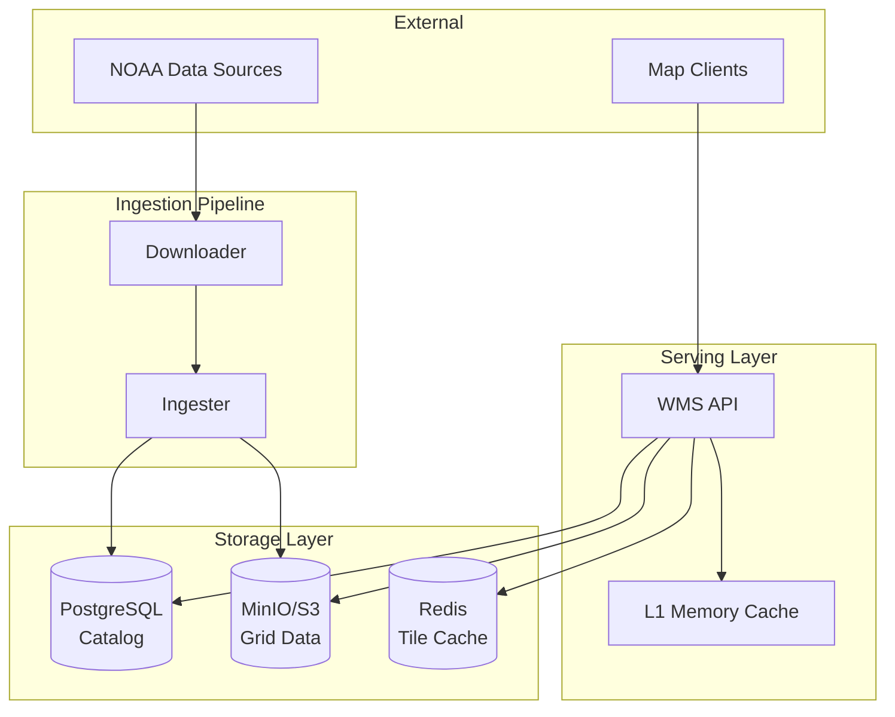

# Architecture Overview

Weather WMS is designed as a cloud-native, high-performance weather data visualization system. This section explains the architectural decisions, design patterns, and data flow that make the system scalable and efficient.

## Key Architectural Principles

### 1. **Microservices Architecture**
Each component has a single, well-defined responsibility:
- **Downloader**: Fetches data from external sources
- **Ingester**: Parses and stores weather data
- **WMS API**: Serves OGC-compliant map requests

### 2. **Cloud-Native Design**
- Stateless services for horizontal scaling
- External state in PostgreSQL, Redis, and MinIO
- Kubernetes-ready with Helm charts
- Health checks and graceful shutdown

### 3. **Two-Tier Caching**
- **L1 (In-Memory)**: Sub-millisecond access, LRU eviction
- **L2 (Redis)**: Shared cache across instances
- Dramatically reduces rendering and I/O load

### 4. **Asynchronous Processing**
- Non-blocking I/O with Tokio runtime
- Concurrent request handling
- Background jobs for cache warming

### 5. **Data Sharding**
Weather data is split into small chunks ("shreds") for:
- Efficient partial reads (only load needed grid cells)
- Parallel processing
- Optimized storage

## System Components



### Storage Layer

| Component | Purpose | Technology | Data Type |
|-----------|---------|------------|-----------|
| PostgreSQL | Metadata catalog | PostgreSQL 15 | Grid metadata, spatial/temporal indices |
| MinIO | Grid data storage | MinIO (S3-compatible) | Shredded binary grid data |
| Redis | Distributed cache | Redis 7 | Rendered PNG tiles |

### Service Layer

| Service | Purpose | Port | Scaling |
|---------|---------|------|---------|
| WMS API | HTTP server for OGC requests | 8080 | Horizontal |
| Ingester | Data parsing and storage | - | Vertical |
| Downloader | Data fetching with resume | 8081 | Horizontal |

## Data Model

### Grid Catalog (PostgreSQL)

```sql
CREATE TABLE grid_catalog (
    id SERIAL PRIMARY KEY,
    model VARCHAR(50),          -- gfs, hrrr, goes18, mrms
    parameter VARCHAR(50),      -- TMP, UGRD, CMI_C13, etc.
    level VARCHAR(50),          -- surface, 2m, 10m, etc.
    reference_time TIMESTAMP,   -- Model run initialization time
    forecast_hour INT,          -- Hours since reference
    valid_time TIMESTAMP,       -- Valid time (reference_time + forecast_hour)
    bbox JSONB,                 -- Bounding box
    storage_path TEXT,          -- MinIO/Zarr path
    file_size BIGINT,           -- Size in bytes
    status VARCHAR(20),         -- available, expired
    zarr_metadata JSONB,        -- Zarr-specific metadata
    ingested_at TIMESTAMP DEFAULT NOW()
);

CREATE INDEX idx_grid_catalog_lookup 
    ON grid_catalog(model, parameter, reference_time, forecast_hour);
```

### Shredded Storage (MinIO)

Binary grid data is split into ~1MB chunks:

```
s3://weather-data/gfs/TMP_2m/2024010100_f000_shard_0000.bin
s3://weather-data/gfs/TMP_2m/2024010100_f000_shard_0001.bin
...
```

Each shard contains:
- Grid values (float32 array)
- Spatial extent (lat/lon bounds)
- Metadata (units, missing value, etc.)

## Design Patterns

### 1. **Repository Pattern**
All data access goes through repository abstractions:
- `CatalogRepository` (PostgreSQL)
- `ObjectStorage` (MinIO/S3)
- `TileCache` (Redis + in-memory)

### 2. **Strategy Pattern**
Multiple rendering strategies:
- Gradient/color ramp
- Contour lines
- Wind barbs
- Numeric labels

### 3. **Cache-Aside Pattern**
Request flow:
1. Check L1 cache → return if hit
2. Check L2 cache → populate L1, return if hit
3. Render from source → populate L2 and L1, return

### 4. **Async/Await Pattern**
All I/O is non-blocking:
```rust
async fn get_tile(params: TileParams) -> Result<Vec<u8>> {
    // Non-blocking database query
    let metadata = catalog.find_grid(&params).await?;
    
    // Non-blocking S3 fetch
    let data = storage.get_shreds(&metadata).await?;
    
    // CPU-bound rendering (still async)
    let tile = tokio::task::spawn_blocking(move || {
        renderer.render(data, params)
    }).await?;
    
    Ok(tile)
}
```

## Sections

- [System Design](./system-design.md) - Detailed component breakdown
- [Data Flow](./data-flow.md) - Request and ingestion flows
- [Caching Strategy](./caching.md) - Two-tier cache architecture
