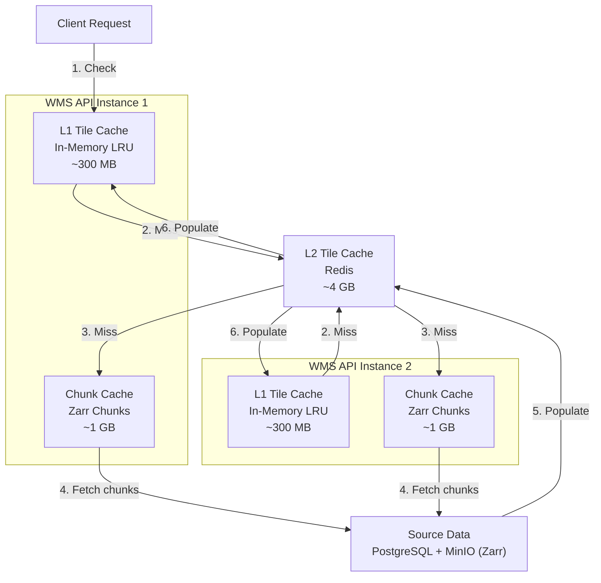
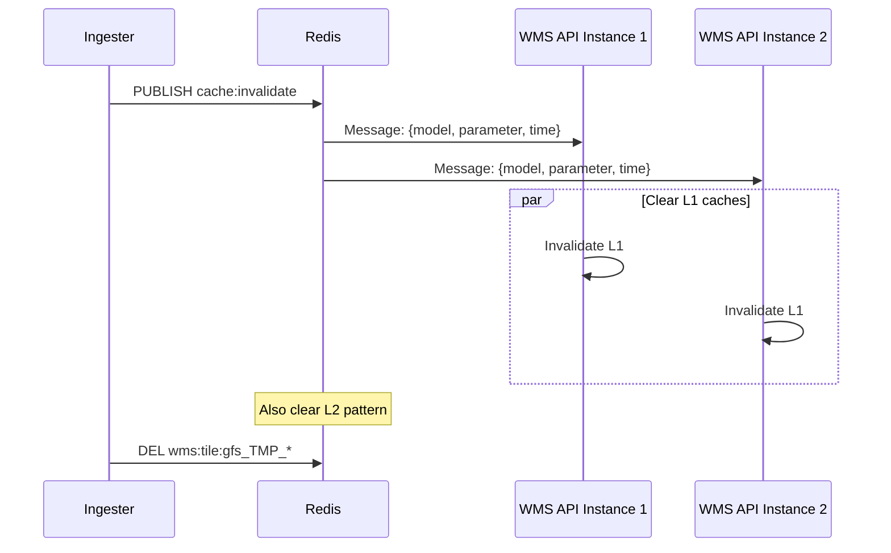

# Caching Strategy

Weather WMS employs a multi-tier caching system to minimize latency and reduce computational load. This page explains the caching architecture, configuration options, and best practices.

## Cache Architecture Overview

The system has three cache layers:
1. **L1 (In-Memory)**: Per-instance LRU cache for rendered PNG tiles
2. **L2 (Redis)**: Shared cache for rendered PNG tiles across instances
3. **Chunk Cache**: In-memory cache for decompressed Zarr data chunks



## L1 Cache: In-Memory

The L1 cache is a per-instance, in-memory cache using an LRU (Least Recently Used) eviction policy.

### Characteristics

| Property | Value |
|----------|-------|
| Location | Process memory (per WMS API instance) |
| Access Time | <1ms (sub-millisecond) |
| Capacity | Configurable (default: 10,000 entries) |
| Eviction | LRU (Least Recently Used) |
| Sharing | Not shared between instances |
| Persistence | No (lost on restart) |

### Configuration

```bash
# .env
ENABLE_L1_CACHE=true
TILE_CACHE_SIZE=10000        # Max entries (~300 MB)
TILE_CACHE_TTL_SECS=300      # TTL: 5 minutes
```

### Implementation

```rust
use lru::LruCache;
use std::sync::Arc;
use tokio::sync::Mutex;

pub struct TileMemoryCache {
    cache: Arc<Mutex<LruCache<String, CachedTile>>>,
    ttl: Duration,
}

struct CachedTile {
    data: Vec<u8>,
    inserted_at: Instant,
}

impl TileMemoryCache {
    pub async fn get(&self, key: &str) -> Option<Vec<u8>> {
        let mut cache = self.cache.lock().await;
        
        if let Some(tile) = cache.get(key) {
            // Check TTL
            if tile.inserted_at.elapsed() < self.ttl {
                return Some(tile.data.clone());
            } else {
                // Expired, remove
                cache.pop(key);
            }
        }
        
        None
    }
    
    pub async fn set(&self, key: String, data: Vec<u8>) {
        let mut cache = self.cache.lock().await;
        cache.put(key, CachedTile {
            data,
            inserted_at: Instant::now(),
        });
    }
    
    pub async fn invalidate(&self, pattern: &str) {
        let mut cache = self.cache.lock().await;
        cache.iter()
            .filter(|(k, _)| k.starts_with(pattern))
            .map(|(k, _)| k.clone())
            .collect::<Vec<_>>()
            .into_iter()
            .for_each(|k| { cache.pop(&k); });
    }
}
```

### Memory Usage

Each cache entry:
- Key: ~100 bytes (string)
- Tile: ~30 KB (256×256 PNG with compression)
- Total: ~30 KB per entry

With 10,000 entries: **~300 MB RAM**

### Trade-offs

**Pros**:
- ⚡ Ultra-fast access (<1ms)
- 🚫 No network overhead
- 🔧 Simple implementation

**Cons**:
- 💾 Limited capacity (RAM constrained)
- 🚫 Not shared between instances
- 🔄 Lost on restart

---

## L2 Cache: Redis

The L2 cache is a shared, distributed cache using Redis with TTL-based expiration.

### Characteristics

| Property | Value |
|----------|-------|
| Location | Redis server (shared) |
| Access Time | 2-5ms (network + lookup) |
| Capacity | Configurable (default: 4 GB) |
| Eviction | LRU + TTL |
| Sharing | Shared across all instances |
| Persistence | Optional (RDB/AOF) |

### Configuration

```bash
# .env
REDIS_URL=redis://redis:6379
REDIS_TILE_TTL_SECS=3600     # TTL: 1 hour

# Redis configuration
maxmemory 4gb
maxmemory-policy allkeys-lru
```

### Implementation

```rust
use redis::aio::ConnectionManager;

pub struct TileRedisCache {
    client: ConnectionManager,
    ttl: u64,
}

impl TileRedisCache {
    pub async fn get(&self, key: &str) -> Result<Option<Vec<u8>>> {
        let mut conn = self.client.clone();
        let value: Option<Vec<u8>> = redis::cmd("GET")
            .arg(key)
            .query_async(&mut conn)
            .await?;
        Ok(value)
    }
    
    pub async fn set(&self, key: &str, data: &[u8]) -> Result<()> {
        let mut conn = self.client.clone();
        redis::cmd("SETEX")
            .arg(key)
            .arg(self.ttl)
            .arg(data)
            .query_async(&mut conn)
            .await?;
        Ok(())
    }
    
    pub async fn invalidate_pattern(&self, pattern: &str) -> Result<()> {
        let mut conn = self.client.clone();
        
        // Find matching keys
        let keys: Vec<String> = redis::cmd("KEYS")
            .arg(pattern)
            .query_async(&mut conn)
            .await?;
        
        // Delete in batch
        if !keys.is_empty() {
            redis::cmd("DEL")
                .arg(&keys)
                .query_async(&mut conn)
                .await?;
        }
        
        Ok(())
    }
}
```

### Memory Usage

With 4 GB Redis and ~30 KB per tile: **~140,000 tiles**

### Trade-offs

**Pros**:
- 🌐 Shared across all instances
- 💾 Larger capacity than L1
- 🔄 Survives instance restarts
- ⏱️ Automatic TTL expiration

**Cons**:
- 🐌 Slower than L1 (network latency)
- 💰 Requires Redis infrastructure
- 🔧 More complex operations

---

## Chunk Cache: Zarr Data

The Chunk Cache stores decompressed Zarr chunks in memory. All weather data is stored in Zarr V3 format with multi-resolution pyramids, and this cache avoids repeatedly fetching and decompressing chunks from MinIO.

### Characteristics

| Property | Value |
|----------|-------|
| Location | Process memory (per WMS API instance) |
| Access Time | <1ms (in-memory) |
| Capacity | Configurable (default: 1 GB) |
| Eviction | LRU (Least Recently Used) |
| Sharing | Not shared between instances |
| Persistence | No (lost on restart) |

### Configuration

```bash
# .env
ENABLE_CHUNK_CACHE=true
CHUNK_CACHE_SIZE_MB=1024     # 1 GB default
```

### How It Works

When rendering a tile:

1. **Calculate required chunks**: Based on the tile bounding box and zoom level
2. **Check chunk cache**: Look for already-decompressed chunks
3. **Fetch missing chunks**: Use HTTP byte-range requests to MinIO
4. **Decompress**: Blosc LZ4 decompression (very fast)
5. **Cache chunks**: Store decompressed data for reuse
6. **Assemble region**: Combine chunks into contiguous grid data

### Implementation

```rust
use grid_processor::ChunkCache;

pub struct ChunkCache {
    cache: LruCache<ChunkKey, Arc<Vec<f32>>>,
    max_bytes: usize,
    current_bytes: usize,
}

#[derive(Hash, Eq, PartialEq)]
struct ChunkKey {
    zarr_path: String,
    pyramid_level: u32,
    chunk_coords: (usize, usize),
}

impl ChunkCache {
    pub fn get(&mut self, key: &ChunkKey) -> Option<Arc<Vec<f32>>> {
        self.cache.get(key).cloned()
    }
    
    pub fn insert(&mut self, key: ChunkKey, data: Vec<f32>) {
        let bytes = data.len() * 4;  // f32 = 4 bytes
        
        // Evict if necessary
        while self.current_bytes + bytes > self.max_bytes {
            if let Some((_, evicted)) = self.cache.pop_lru() {
                self.current_bytes -= evicted.len() * 4;
            }
        }
        
        self.current_bytes += bytes;
        self.cache.put(key, Arc::new(data));
    }
}
```

### Memory Usage

Chunk sizes vary by dataset:

| Dataset | Chunk Size | Decompressed |
|---------|------------|--------------|
| GFS (512×512) | ~200 KB | ~1 MB |
| HRRR (512×512) | ~200 KB | ~1 MB |
| GOES (512×512) | ~400 KB | ~1 MB |

With 1 GB cache: **~1,000 chunks**

### Trade-offs

**Pros**:
- ⚡ Ultra-fast chunk access (<1ms)
- 🔧 Automatic pyramid level selection
- 📦 Only loads needed chunks (partial reads)
- 🎯 Perfect for tile rendering workloads

**Cons**:
- 💾 RAM constrained per instance
- 🚫 Not shared between instances
- 🔄 Lost on restart

### Chunk Warming

The `ChunkWarmer` pre-populates the chunk cache for frequently-accessed data:

```yaml
# config/models/goes16.yaml
precaching:
  enabled: true
  keep_recent: 3          # Keep 3 most recent observations
  warm_on_ingest: true    # Warm after new data arrives
  poll_interval_secs: 60
  parameters: [CMI_C02, CMI_C13]
  zoom_levels: [0, 2, 4]  # Pre-warm at these zoom levels
```

This ensures common zoom levels are cached before users request them, providing instant response times.

---

## Cache Key Format

All cache keys follow a consistent format for easy invalidation and debugging.

### Format

```
wms:tile:{layer}:{style}:{crs}:{bbox}:{width}x{height}:{time}:{format}
```

### Examples

```
wms:tile:gfs_TMP_2m:temperature:EPSG:3857:-180,-90,180,90:256x256:2024-12-03T00:00:00Z:png
wms:tile:goes18_CMI_C13:goes_ir:EPSG:4326:-125,25,-65,50:512x512:latest:png
wms:tile:hrrr_UGRD_10m:wind:EPSG:3857:-13149614,3503549,-10018754,6634109:256x256:2024-12-03T06:00:00Z:png
```

### Key Components

| Component | Description | Example |
|-----------|-------------|---------|
| `layer` | Model + parameter | `gfs_TMP_2m` |
| `style` | Visualization style | `temperature` |
| `crs` | Coordinate system | `EPSG:3857` |
| `bbox` | Bounding box | `-180,-90,180,90` |
| `width`×`height` | Tile dimensions | `256x256` |
| `time` | Forecast time or "latest" | `2024-12-03T00:00:00Z` |
| `format` | Image format | `png` |

### Normalization

Keys are normalized to ensure cache hits:

```rust
fn normalize_cache_key(params: &WmsParams) -> String {
    format!(
        "wms:tile:{}:{}:{}:{}:{}x{}:{}:{}",
        params.layer.to_lowercase(),
        params.style.to_lowercase(),
        params.crs.to_uppercase(),
        normalize_bbox(&params.bbox),  // Round to 6 decimals
        params.width,
        params.height,
        params.time.unwrap_or("latest"),
        params.format.to_lowercase()
    )
}
```

---

## TTL Strategy

Time-To-Live (TTL) varies based on data age to balance freshness and cache efficiency.

### Dynamic TTL

```rust
fn calculate_ttl(forecast_time: DateTime<Utc>) -> u64 {
    let age = Utc::now() - forecast_time;
    
    if age < Duration::hours(6) {
        // Recent data: 1 hour
        3600
    } else if age < Duration::hours(24) {
        // Today's data: 2 hours
        7200
    } else {
        // Archive data: 24 hours
        86400
    }
}
```

### TTL Table

| Data Age | L1 TTL | L2 TTL | Rationale |
|----------|--------|--------|-----------|
| 0-6 hours | 5 min | 1 hour | Frequently updated |
| 6-24 hours | 5 min | 2 hours | Semi-static |
| 1+ days | 5 min | 24 hours | Static archive |

---

## Cache Invalidation

When new data is ingested, caches must be invalidated to prevent serving stale data.

### Invalidation Flow



### Implementation

**Publisher (Ingester)**:
```rust
async fn invalidate_caches(
    redis: &Redis,
    model: &str,
    parameter: &str,
    time: DateTime<Utc>,
) -> Result<()> {
    let message = serde_json::json!({
        "model": model,
        "parameter": parameter,
        "time": time.to_rfc3339()
    });
    
    // Publish to subscribers
    redis.publish("cache:invalidate", message.to_string()).await?;
    
    // Also clear L2 cache directly
    let pattern = format!("wms:tile:{}_{}_*", model, parameter);
    redis.del_pattern(&pattern).await?;
    
    Ok(())
}
```

**Subscriber (WMS API)**:
```rust
async fn subscribe_to_invalidations(
    redis: Redis,
    l1_cache: Arc<TileMemoryCache>,
) {
    let mut pubsub = redis.into_pubsub();
    pubsub.subscribe("cache:invalidate").await.unwrap();
    
    while let Some(msg) = pubsub.on_message().next().await {
        let payload: CacheInvalidation = serde_json::from_str(
            msg.get_payload::<String>().unwrap()
        ).unwrap();
        
        // Invalidate L1 cache
        let pattern = format!("wms:tile:{}_{}_", payload.model, payload.parameter);
        l1_cache.invalidate(&pattern).await;
        
        info!("Invalidated cache for {}_{}", payload.model, payload.parameter);
    }
}
```

---

## Cache Warming

Pre-rendering tiles before they're requested improves perceived performance.

### Startup Warming

Warm popular tiles at service startup:

```bash
# .env
ENABLE_CACHE_WARMING=true
CACHE_WARMING_MAX_ZOOM=4              # Warm zooms 0-4 (341 tiles)
CACHE_WARMING_HOURS=0,3,6             # Forecast hours
CACHE_WARMING_LAYERS=gfs_TMP_2m:temperature;goes18_CMI_C13:goes_ir
CACHE_WARMING_CONCURRENCY=10          # Parallel workers
```

### Implementation

```rust
async fn warm_cache(config: &CacheWarmingConfig) -> Result<()> {
    let layers: Vec<_> = config.layers.split(';')
        .map(|s| s.split_once(':').unwrap())
        .collect();
    
    let mut tasks = Vec::new();
    
    for (layer, style) in layers {
        for hour in &config.hours {
            for z in 0..=config.max_zoom {
                let tiles = tiles_at_zoom(z);
                
                for (x, y) in tiles {
                    let task = render_and_cache(layer, style, z, x, y, *hour);
                    tasks.push(task);
                }
            }
        }
    }
    
    // Execute with concurrency limit
    let semaphore = Arc::new(Semaphore::new(config.concurrency));
    for task in tasks {
        let permit = semaphore.clone().acquire_owned().await?;
        tokio::spawn(async move {
            task.await;
            drop(permit);
        });
    }
    
    Ok(())
}
```

## Prefetching

Predictively fetch surrounding tiles when a tile is requested.

### Configuration

```bash
# .env
ENABLE_PREFETCH=true
PREFETCH_RINGS=2          # Rings around requested tile
PREFETCH_MIN_ZOOM=3       # Don't prefetch below zoom 3
PREFETCH_MAX_ZOOM=12      # Don't prefetch above zoom 12
```

### Algorithm

```rust
async fn prefetch_neighbors(
    z: u32,
    x: u32,
    y: u32,
    rings: u32,
    params: &RenderParams,
) {
    if z < PREFETCH_MIN_ZOOM || z > PREFETCH_MAX_ZOOM {
        return;
    }
    
    let neighbors = calculate_ring_tiles(z, x, y, rings);
    
    for (nx, ny) in neighbors {
        // Spawn background task (don't await)
        tokio::spawn(async move {
            let _ = get_or_render_tile(z, nx, ny, params).await;
        });
    }
}

fn calculate_ring_tiles(z: u32, x: u32, y: u32, rings: u32) -> Vec<(u32, u32)> {
    let mut tiles = Vec::new();
    let r = rings as i32;
    
    for dy in -r..=r {
        for dx in -r..=r {
            if dx == 0 && dy == 0 {
                continue;  // Skip center tile
            }
            
            let nx = (x as i32 + dx) as u32;
            let ny = (y as i32 + dy) as u32;
            
            if is_valid_tile(z, nx, ny) {
                tiles.push((nx, ny));
            }
        }
    }
    
    tiles
}
```

### Ring Sizes

| Rings | Tiles Prefetched |
|-------|------------------|
| 1 | 8 (3×3 - 1) |
| 2 | 24 (5×5 - 1) |
| 3 | 48 (7×7 - 1) |

**Recommendation**: Use 2 rings for balanced prefetching without overwhelming the cache.

---

## Cache Performance Metrics

Monitor cache performance via Prometheus metrics:

```rust
// Metrics definitions
lazy_static! {
    static ref CACHE_HITS: IntCounterVec = register_int_counter_vec!(
        "wms_cache_hits_total",
        "Cache hits by tier",
        &["tier"]  // "l1" or "l2"
    ).unwrap();
    
    static ref CACHE_MISSES: IntCounter = register_int_counter!(
        "wms_cache_misses_total",
        "Cache misses"
    ).unwrap();
    
    static ref CACHE_LATENCY: HistogramVec = register_histogram_vec!(
        "wms_cache_latency_seconds",
        "Cache operation latency",
        &["tier", "operation"]
    ).unwrap();
}

// Instrument cache access
async fn get_from_cache(key: &str) -> Option<Vec<u8>> {
    // Try L1
    let timer = CACHE_LATENCY.with_label_values(&["l1", "get"]).start_timer();
    if let Some(data) = l1_cache.get(key).await {
        timer.observe_duration();
        CACHE_HITS.with_label_values(&["l1"]).inc();
        return Some(data);
    }
    
    // Try L2
    let timer = CACHE_LATENCY.with_label_values(&["l2", "get"]).start_timer();
    if let Some(data) = l2_cache.get(key).await? {
        timer.observe_duration();
        CACHE_HITS.with_label_values(&["l2"]).inc();
        l1_cache.set(key.to_string(), data.clone()).await;
        return Some(data);
    }
    
    // Cache miss
    CACHE_MISSES.inc();
    None
}
```

### Key Metrics

| Metric | Description | Target |
|--------|-------------|--------|
| Cache hit rate (L1) | % of requests served by L1 | >50% |
| Cache hit rate (L2) | % of L1 misses served by L2 | >80% |
| Total hit rate | % of requests served by cache | >90% |
| L1 latency (p99) | 99th percentile L1 access | <1ms |
| L2 latency (p99) | 99th percentile L2 access | <10ms |

View in Grafana: http://localhost:3001

---

## Best Practices

### 1. Right-Size Your Caches

```bash
# Small deployment (4 GB RAM)
TILE_CACHE_SIZE=1000          # ~30 MB L1
maxmemory 500mb               # Redis

# Medium deployment (16 GB RAM)
TILE_CACHE_SIZE=10000         # ~300 MB L1
maxmemory 4gb                 # Redis

# Large deployment (64 GB RAM)
TILE_CACHE_SIZE=50000         # ~1.5 GB L1
maxmemory 16gb                # Redis
```

### 2. Tune TTLs for Your Use Case

**Real-time data** (MRMS radar):
```bash
TILE_CACHE_TTL_SECS=60        # 1 minute L1
REDIS_TILE_TTL_SECS=300       # 5 minutes L2
```

**Forecast data** (GFS, HRRR):
```bash
TILE_CACHE_TTL_SECS=300       # 5 minutes L1
REDIS_TILE_TTL_SECS=3600      # 1 hour L2
```

**Archive data**:
```bash
TILE_CACHE_TTL_SECS=3600      # 1 hour L1
REDIS_TILE_TTL_SECS=86400     # 24 hours L2
```

### 3. Monitor and Adjust

- **Low hit rate (<80%)**: Increase cache size or TTL
- **High memory usage**: Reduce cache size or lower TTL
- **Slow tile rendering**: Enable prefetching and cache warming

---

## Next Steps

- [System Design](./system-design.md) - Component architecture
- [Data Flow](./data-flow.md) - Request and ingestion flows
- [Deployment](../deployment/monitoring.md) - Monitoring with Grafana
