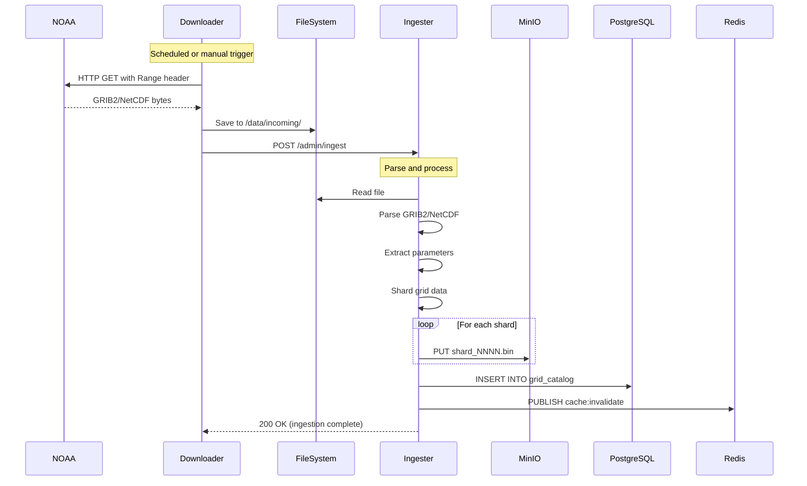
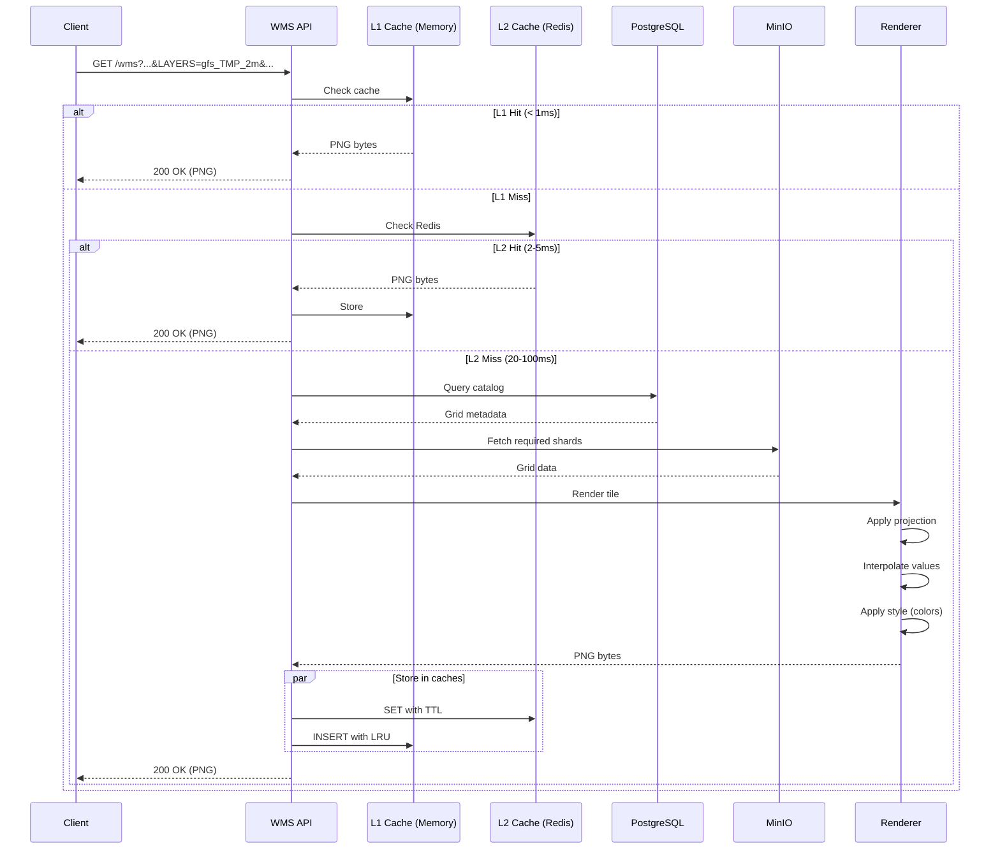

# Data Flow

This page describes the two primary data flows in Weather WMS: **ingestion** (how data enters the system) and **request** (how data is served to clients).

## Ingestion Flow

The ingestion pipeline fetches data from NOAA, parses it, shreds it, and stores it in the catalog.

### High-Level Ingestion Flow



### Step-by-Step Ingestion

#### 1. Download

**Trigger**: Cron schedule or manual API call

```bash
# Automated (cron)
0 * * * * /app/scripts/download_gfs.sh

# Manual
curl -X POST http://localhost:8081/download \
  -H "Content-Type: application/json" \
  -d '{"model": "gfs", "cycle": "00"}'
```

**Download Process**:
```rust
async fn download_file(url: &str, dest: &Path) -> Result<()> {
    let client = reqwest::Client::new();
    
    // Check if partial file exists
    let downloaded = if dest.exists() {
        dest.metadata()?.len()
    } else {
        0
    };
    
    // Resume from where we left off
    let response = client.get(url)
        .header("Range", format!("bytes={}-", downloaded))
        .send()
        .await?;
    
    let mut file = OpenOptions::new()
        .create(true)
        .append(true)
        .open(dest)?;
    
    let mut stream = response.bytes_stream();
    while let Some(chunk) = stream.next().await {
        file.write_all(&chunk?)?;
    }
    
    Ok(())
}
```

**Output**: `/data/incoming/gfs.t00z.pgrb2.0p25.f000`

---

#### 2. Parse

**Trigger**: HTTP POST to `/admin/ingest` with file path

```bash
curl -X POST http://localhost:8080/admin/ingest \
  -H "Content-Type: application/json" \
  -d '{"path": "/data/incoming/gfs.t00z.pgrb2.0p25.f000", "model": "gfs"}'
```

**Parse Process**:

For **GRIB2** (GFS, HRRR, MRMS):
```rust
async fn parse_grib2(path: &Path) -> Result<Vec<GribMessage>> {
    let bytes = tokio::fs::read(path).await?;
    let parser = Grib2Parser::new(&bytes)?;
    
    let mut messages = Vec::new();
    for message in parser.messages() {
        let metadata = extract_metadata(&message)?;
        let grid = decode_grid_data(&message)?;
        let projection = determine_projection(&message)?;
        
        messages.push(GribMessage {
            parameter: metadata.parameter,
            level: metadata.level,
            forecast_time: metadata.forecast_time,
            valid_time: metadata.valid_time,
            grid,
            projection,
        });
    }
    
    Ok(messages)
}
```

For **NetCDF** (GOES):
```rust
async fn parse_netcdf(path: &Path) -> Result<GoesData> {
    let file = netcdf::open(path)?;
    
    let variable = file.variable("CMI")?;  // Channel data
    let data: Array2<f32> = variable.get()?;
    
    let projection = GeoStationaryProjection {
        satellite_height: file.attribute("satellite_height")?,
        longitude: file.attribute("longitude_of_projection_origin")?,
        sweep_angle: file.attribute("sweep_angle_axis")?,
    };
    
    Ok(GoesData { data, projection })
}
```

---

#### 3. Shard

Split large grids into ~1MB chunks for efficient partial access.

**Shredding Algorithm**:
```rust
fn shard_grid(grid: &Array2<f32>, target_size_bytes: usize) -> Vec<GridShard> {
    let (ny, nx) = grid.dim();
    let bytes_per_cell = std::mem::size_of::<f32>();
    
    // Calculate optimal shard width
    let cells_per_shard = target_size_bytes / (bytes_per_cell * ny);
    let num_shards = (nx + cells_per_shard - 1) / cells_per_shard;
    
    let mut shards = Vec::new();
    for i in 0..num_shards {
        let x_start = i * cells_per_shard;
        let x_end = usize::min((i + 1) * cells_per_shard, nx);
        
        // Extract column range
        let shard_data = grid.slice(s![.., x_start..x_end]).to_owned();
        
        // Calculate geographic bounds for this shard
        let bounds = calculate_bounds(projection, x_start, x_end, ny);
        
        shards.push(GridShard {
            index: i,
            data: shard_data,
            bounds,
        });
    }
    
    shards
}
```

**Example**:
- GFS grid: 1440 × 721 (lon × lat) = 1,038,240 cells
- Cell size: 4 bytes (f32)
- Total: ~4 MB
- Target shard size: 1 MB
- Shards: 4 (each ~260,000 cells)

---

#### 4. Store

Upload shards to MinIO and register in PostgreSQL catalog.

**MinIO Upload**:
```rust
async fn store_shards(
    storage: &ObjectStorage,
    shards: Vec<GridShard>,
    metadata: &GridMetadata,
) -> Result<String> {
    let path_prefix = format!(
        "{}/{}/{}_f{:03}",
        metadata.model,
        metadata.parameter,
        metadata.forecast_time.format("%Y%m%d%H"),
        metadata.forecast_hour
    );
    
    // Upload shards in parallel
    let handles: Vec<_> = shards.into_iter().enumerate().map(|(i, shard)| {
        let storage = storage.clone();
        let path = format!("{}_shard_{:04}.bin", path_prefix, i);
        
        tokio::spawn(async move {
            let bytes = serialize_shard(&shard)?;
            storage.put(&path, bytes).await
        })
    }).collect();
    
    // Wait for all uploads
    for handle in handles {
        handle.await??;
    }
    
    Ok(path_prefix)
}
```

**Catalog Registration**:
```sql
INSERT INTO grid_catalog (
    model, parameter, level_type, level_value,
    forecast_time, valid_time, forecast_hour,
    projection, grid_shape, bbox,
    storage_path, shard_count
) VALUES (
    'gfs', 'TMP', '2m', 2.0,
    '2024-12-03 00:00:00', '2024-12-03 00:00:00', 0,
    '{"type": "latlon", "resolution": 0.25}'::jsonb,
    '{"nx": 1440, "ny": 721}'::jsonb,
    '{"west": -180, "south": -90, "east": 180, "north": 90}'::jsonb,
    'gfs/TMP_2m/2024120300_f000',
    4
);
```

---

#### 5. Invalidate Caches

Notify all WMS API instances to invalidate cached tiles for updated data.

```rust
// Publisher (ingester)
redis.publish("cache:invalidate", json!({
    "model": "gfs",
    "parameter": "TMP_2m",
    "forecast_time": "2024-12-03T00:00:00Z"
})).await?;

// Subscriber (wms-api)
let mut pubsub = redis.get_async_connection().await?.into_pubsub();
pubsub.subscribe("cache:invalidate").await?;

while let Some(msg) = pubsub.on_message().next().await {
    let payload: CacheInvalidation = serde_json::from_str(msg.get_payload())?;
    
    // Clear L1 cache
    l1_cache.invalidate(&payload.model, &payload.parameter).await?;
    
    // Clear L2 cache
    let pattern = format!("wms:tile:{}_{}_*", payload.model, payload.parameter);
    redis.del_pattern(&pattern).await?;
}
```

---

## Request Flow

Client requests go through multiple cache layers before falling back to rendering from source data.

### High-Level Request Flow



### Step-by-Step Request Handling

#### 1. Parse Request

```rust
#[derive(Deserialize)]
struct WmsGetMapParams {
    service: String,         // "WMS"
    version: String,         // "1.3.0"
    request: String,         // "GetMap"
    layers: String,          // "gfs_TMP_2m"
    styles: String,          // "temperature"
    crs: String,             // "EPSG:3857"
    bbox: String,            // "-180,-90,180,90"
    width: u32,              // 256
    height: u32,             // 256
    format: String,          // "image/png"
    time: Option<String>,    // "2024-12-03T00:00:00Z"
}

async fn wms_get_map(
    Query(params): Query<WmsGetMapParams>,
    State(state): State<AppState>,
) -> Result<Response<Body>> {
    // Validate parameters
    validate_wms_params(&params)?;
    
    // Generate cache key
    let cache_key = format!(
        "wms:tile:{}:{}:{}:{}:{}:{}:{}",
        params.layers, params.styles, params.crs,
        params.bbox, params.width, params.height,
        params.time.as_deref().unwrap_or("latest")
    );
    
    // Check caches and render
    let tile = get_or_render_tile(&cache_key, &params, &state).await?;
    
    Ok(Response::builder()
        .header("Content-Type", "image/png")
        .header("Cache-Control", "public, max-age=3600")
        .body(Body::from(tile))?)
}
```

---

#### 2. Check L1 Cache

```rust
async fn check_l1_cache(cache: &TileMemoryCache, key: &str) -> Option<Vec<u8>> {
    cache.get(key).await
}

// L1 cache implementation (LRU)
pub struct TileMemoryCache {
    cache: Arc<Mutex<LruCache<String, Vec<u8>>>>,
}

impl TileMemoryCache {
    pub async fn get(&self, key: &str) -> Option<Vec<u8>> {
        let mut cache = self.cache.lock().await;
        cache.get(key).cloned()
    }
    
    pub async fn set(&self, key: String, value: Vec<u8>) {
        let mut cache = self.cache.lock().await;
        cache.put(key, value);
    }
}
```

**Performance**: <1ms (in-process memory access)

---

#### 3. Check L2 Cache (Redis)

```rust
async fn check_l2_cache(redis: &RedisCache, key: &str) -> Result<Option<Vec<u8>>> {
    redis.get_bytes(key).await
}

// Redis cache implementation
impl RedisCache {
    pub async fn get_bytes(&self, key: &str) -> Result<Option<Vec<u8>>> {
        let mut conn = self.pool.get().await?;
        let value: Option<Vec<u8>> = conn.get(key).await?;
        Ok(value)
    }
    
    pub async fn set_bytes(&self, key: &str, value: &[u8], ttl: u64) -> Result<()> {
        let mut conn = self.pool.get().await?;
        conn.set_ex(key, value, ttl).await?;
        Ok(())
    }
}
```

**Performance**: 2-5ms (network + Redis lookup)

---

#### 4. Query Catalog

Find grid metadata for the requested layer and time.

```rust
async fn find_grid(
    catalog: &Catalog,
    model: &str,
    parameter: &str,
    time: DateTime<Utc>,
) -> Result<GridMetadata> {
    let sql = "
        SELECT id, model, parameter, level_type, level_value,
               forecast_time, valid_time, forecast_hour,
               projection, grid_shape, bbox,
               storage_path, shard_count
        FROM grid_catalog
        WHERE model = $1 AND parameter = $2
          AND forecast_time <= $3
        ORDER BY forecast_time DESC, forecast_hour ASC
        LIMIT 1
    ";
    
    let row = sqlx::query(sql)
        .bind(model)
        .bind(parameter)
        .bind(time)
        .fetch_one(&catalog.pool)
        .await?;
    
    Ok(GridMetadata::from_row(&row)?)
}
```

**Performance**: 5-20ms (indexed query)

---

#### 5. Fetch Shards

Fetch only the shards intersecting the requested bbox.

```rust
async fn fetch_shards(
    storage: &ObjectStorage,
    metadata: &GridMetadata,
    bbox: &BoundingBox,
) -> Result<Vec<GridShard>> {
    // Determine which shards intersect bbox
    let shard_indices = calculate_intersecting_shards(metadata, bbox);
    
    // Fetch shards in parallel
    let handles: Vec<_> = shard_indices.into_iter().map(|i| {
        let storage = storage.clone();
        let path = format!("{}_shard_{:04}.bin", metadata.storage_path, i);
        
        tokio::spawn(async move {
            let bytes = storage.get(&path).await?;
            deserialize_shard(&bytes)
        })
    }).collect();
    
    let mut shards = Vec::new();
    for handle in handles {
        shards.push(handle.await??);
    }
    
    Ok(shards)
}
```

**Performance**: 10-50ms (parallel S3 fetches)

---

#### 6. Render Tile

Apply projection, interpolation, and styling to generate PNG.

```rust
async fn render_tile(
    shards: Vec<GridShard>,
    params: &RenderParams,
    style: &Style,
) -> Result<Vec<u8>> {
    // This is CPU-intensive, run in blocking thread pool
    tokio::task::spawn_blocking(move || {
        // 1. Reproject to target CRS
        let reprojected = reproject_grid(&shards, &params.source_crs, &params.target_crs)?;
        
        // 2. Interpolate to tile grid
        let interpolated = interpolate_to_grid(
            &reprojected,
            params.width,
            params.height,
            &params.bbox,
        )?;
        
        // 3. Apply colormap/style
        let colored = apply_style(&interpolated, style)?;
        
        // 4. Encode as PNG
        let mut encoder = png::Encoder::new(Vec::new(), params.width, params.height);
        encoder.set_color(png::ColorType::Rgba);
        let png_bytes = encoder.write_header()?.write_image_data(&colored)?;
        
        Ok(png_bytes)
    }).await?
}
```

**Performance**: 20-100ms (CPU-bound)

---

#### 7. Store in Caches

```rust
// Store in both caches
let ttl = calculate_ttl(&metadata);
tokio::join!(
    l1_cache.set(cache_key.clone(), tile.clone()),
    l2_cache.set_bytes(&cache_key, &tile, ttl),
);
```

---

## Performance Optimization Strategies

### 1. Tile Prefetching

When a tile is requested, prefetch surrounding tiles:

```rust
async fn prefetch_neighbors(
    z: u32, x: u32, y: u32,
    rings: u32,
    params: &RenderParams,
) {
    let neighbors = calculate_neighbor_tiles(z, x, y, rings);
    
    for (nx, ny) in neighbors {
        tokio::spawn(async move {
            let _ = get_or_render_tile(&cache_key(z, nx, ny), params).await;
        });
    }
}
```

### 2. Cache Warming

Pre-render popular tiles at startup:

```rust
async fn warm_cache(layers: Vec<String>, max_zoom: u32) {
    for layer in layers {
        for z in 0..=max_zoom {
            let tiles = all_tiles_at_zoom(z);
            for (x, y) in tiles {
                render_tile(layer, z, x, y).await;
            }
        }
    }
}
```

### 3. Partial Grid Loading

Only load shards intersecting the request bbox:

```
Requested bbox: [-100, 30, -90, 40]
Grid extent: [-180, -90, 180, 90]
Shards: 0, 1, 2, 3

Shard 0: [-180, -90, -90, 90]  ❌ No overlap
Shard 1: [-90, -90, 0, 90]     ✓ Overlaps
Shard 2: [0, -90, 90, 90]      ❌ No overlap
Shard 3: [90, -90, 180, 90]    ❌ No overlap

Only fetch shard 1 (25% of data)
```

## Next Steps

- [Caching Strategy](./caching.md) - Detailed cache configuration
- [Services](../services/README.md) - Individual service deep-dives
- [API Reference](../api-reference/README.md) - Complete API documentation
