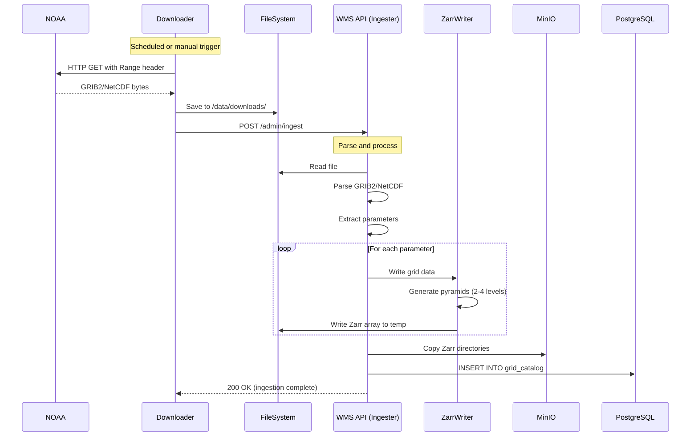
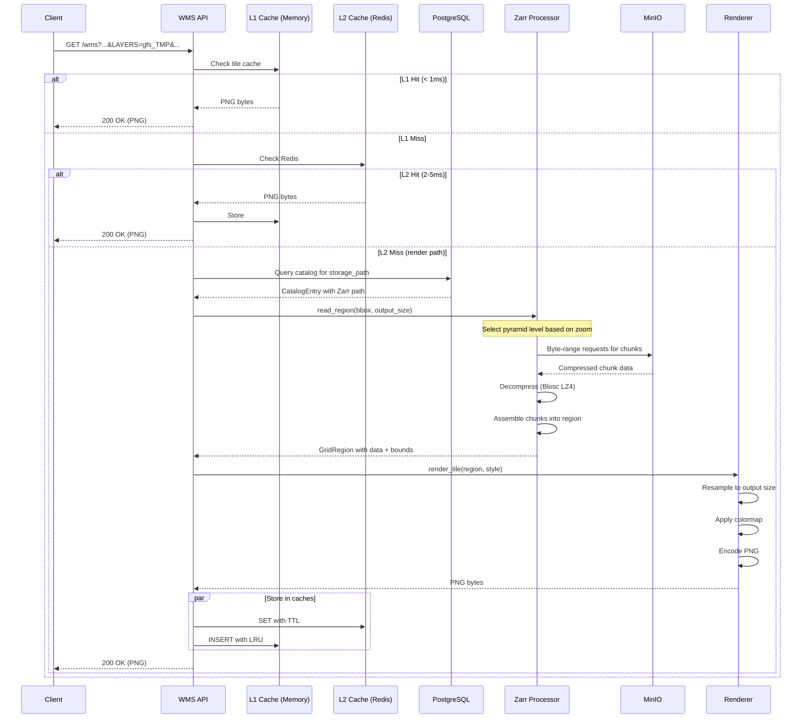

# Data Flow

This page describes the two primary data flows in Weather WMS: **ingestion** (how data enters the system) and **request** (how data is served to clients).

## Ingestion Flow

The ingestion pipeline fetches data from NOAA, parses it, converts it to Zarr V3 format with multi-resolution pyramids, and stores it in MinIO with metadata in PostgreSQL.

### High-Level Ingestion Flow



### Step-by-Step Ingestion

#### 1. Download

**Trigger**: Cron schedule or automatic polling by Downloader service

```rust
// Downloader checks for new files every poll_interval_secs
let url = format!(
    "https://noaa-gfs-bdp-pds.s3.amazonaws.com/gfs.{date}/{cycle}/atmos/gfs.t{cycle}z.pgrb2.0p25.f{fhr:03}",
    date = "20241217",
    cycle = "12",
    fhr = 3
);

// Download with resume support
let response = client.get(&url)
    .header("Range", format!("bytes={}-", downloaded_bytes))
    .send()
    .await?;
```

**Output**: `/data/downloads/gfs_20241217_12z_f003.grib2` (~550 MB)

---

#### 2. Trigger Ingestion

```bash
# Downloader automatically calls this after download completes
POST http://localhost:8080/admin/ingest
Content-Type: application/json

{
  "file_path": "/data/downloads/gfs_20241217_12z_f003.grib2",
  "model": "gfs"
}
```

---

#### 3. Parse File

**GRIB2 Parsing** (GFS, HRRR, MRMS):
```rust
let bytes = Bytes::from(fs::read(&path)?);
let mut reader = grib2_parser::Grib2Reader::new(bytes);

while let Some(message) = reader.next_message().ok().flatten() {
    let param = &message.product_definition.parameter_short_name;  // "TMP"
    let level = &message.product_definition.level_description;     // "2 m above ground"
    let level_type = message.product_definition.level_type;        // 103
    
    // Check if this parameter/level is in our target list
    if should_ingest(param, level_type, level_value) {
        let grid_data = message.unpack_data()?;  // Decompress grid values
        let width = message.grid_definition.num_points_longitude;  // 1440
        let height = message.grid_definition.num_points_latitude;  // 721
        
        // Process this parameter...
    }
}
```

**NetCDF Parsing** (GOES satellites):
```rust
let parser = netcdf_parser::GoesParser::open(&path)?;
let data = parser.read_data()?;           // 5424x5424 grid
let projection = parser.get_projection()?; // Geostationary projection
let channel = parser.get_channel()?;       // e.g., "C13"
```

---

#### 4. Write to Zarr

Grid data is written to Zarr V3 format with multi-resolution pyramids:

```rust
use grid_processor::{ZarrWriter, GridProcessorConfig, PyramidConfig, DownsampleMethod};

let config = GridProcessorConfig {
    zarr_chunk_size: 512,           // 512x512 chunks
    pyramid: Some(PyramidConfig {
        levels: 2,                  // Full + 2x downsampled
        method: DownsampleMethod::Average,
        min_dimension: 256,
    }),
    compression: ZarrCompression::BloscLz4 { level: 5 },
    ..Default::default()
};

let writer = ZarrWriter::new(config);

// Write with pyramids
let result = writer.write_with_pyramids(
    filesystem_store,    // Write to local temp first
    &grid_data,
    width, height,
    &bbox,
    model, parameter, level, units,
    reference_time, forecast_hour,
)?;
```

**Zarr Output Structure**:
```
/tmp/zarr/tmp_2_m_above_ground_f003.zarr/
├── zarr.json                    # Root group metadata with multiscale info
├── 0/                           # Level 0: Full resolution (1440×721)
│   ├── zarr.json               # Array metadata (shape, chunks, codecs)
│   └── c/                      # Chunks directory
│       ├── 0/0                 # Chunk (0,0) - compressed f32 data
│       ├── 0/1                 # Chunk (0,1)
│       ├── 1/0                 # Chunk (1,0)
│       └── 1/1                 # Chunk (1,1) - 4 chunks for 512×512 chunk size
└── 1/                           # Level 1: 2x downsampled (720×360)
    ├── zarr.json
    └── c/
        ├── 0/0                 # Single chunk (720×360 < 512×512)
        └── ...
```

---

#### 5. Upload to MinIO

```rust
// Copy entire Zarr directory tree to MinIO
let minio_path = format!(
    "grids/{}/{}/{}_{}_f{:03}.zarr",
    model,                           // "gfs"
    run_date,                        // "20241217_12z"
    param.to_lowercase(),           // "tmp"
    level_sanitized,                // "2_m_above_ground"
    forecast_hour                   // 3
);

// Recursive copy preserving directory structure
copy_dir_to_minio(&local_zarr_path, &minio_path, &storage).await?;

// Result: s3://weather-data/grids/gfs/20241217_12z/tmp_2_m_above_ground_f003.zarr/
```

---

#### 6. Register in Catalog

```rust
let entry = CatalogEntry {
    model: "gfs".to_string(),
    parameter: "TMP".to_string(),
    level: "2 m above ground".to_string(),
    reference_time,               // 2024-12-17T12:00:00Z
    forecast_hour: 3,
    storage_path: minio_path,     // "grids/gfs/20241217_12z/tmp_2_m_above_ground_f003.zarr"
    bbox: serde_json::json!({
        "min_lon": 0.0, "max_lon": 360.0,
        "min_lat": -90.0, "max_lat": 90.0
    }),
    grid_shape: serde_json::json!([1440, 721]),
    zarr_metadata: Some(result.metadata.to_json()),
    created_at: Utc::now(),
};

catalog.insert(&entry).await?;
```

**PostgreSQL Record**:
```sql
INSERT INTO grid_catalog (
    model, parameter, level, reference_time, forecast_hour,
    storage_path, bbox, grid_shape, zarr_metadata
) VALUES (
    'gfs', 'TMP', '2 m above ground', '2024-12-17 12:00:00+00', 3,
    'grids/gfs/20241217_12z/tmp_2_m_above_ground_f003.zarr',
    '{"min_lon": 0, "max_lon": 360, "min_lat": -90, "max_lat": 90}',
    '[1440, 721]',
    '{"shape": [1440, 721], "chunk_shape": [512, 512], "compression": "blosc_lz4"}'
);
```

---

## Request Flow

Client requests go through multiple cache layers before falling back to Zarr data reads and rendering.

### High-Level Request Flow



### Step-by-Step Request Handling

#### 1. Parse Request

```rust
// WMS GetMap request
GET /wms?SERVICE=WMS&REQUEST=GetMap&VERSION=1.3.0
    &LAYERS=gfs_TMP
    &STYLES=temperature
    &CRS=EPSG:3857
    &BBOX=-10018754,2504688,-7514066,5009377
    &WIDTH=256
    &HEIGHT=256
    &FORMAT=image/png
    &ELEVATION=2%20m%20above%20ground

// Parse into struct
let params = WmsGetMapParams {
    layers: "gfs_TMP",
    styles: "temperature",
    crs: CrsCode::EPSG3857,
    bbox: BoundingBox::new(-10018754, 2504688, -7514066, 5009377),
    width: 256,
    height: 256,
    elevation: Some("2 m above ground"),
    ...
};
```

---

#### 2. Generate Cache Key

```rust
let cache_key = CacheKey::new(
    &params.layers,      // "gfs_TMP"
    &params.styles,      // "temperature"
    &params.crs,         // EPSG:3857
    &params.bbox,        // Tile bounds
    params.width,        // 256
    params.height,       // 256
    reference_time,      // Latest or specified
    forecast_hour,       // 0-384
    &params.elevation,   // "2 m above ground"
);

// Result: "wms:tile:gfs_TMP:temperature:EPSG3857:-10018754,2504688,-7514066,5009377:256x256:20241217T12:f003:2_m_above_ground"
```

---

#### 3. Check Caches

**L1 (Memory) - < 1ms**:
```rust
if let Some(tile) = memory_cache.get(&cache_key).await {
    return Ok(tile);
}
```

**L2 (Redis) - 2-5ms**:
```rust
if let Some(tile) = redis_cache.get(&cache_key).await? {
    memory_cache.set(cache_key.clone(), tile.clone()).await;
    return Ok(tile);
}
```

---

#### 4. Query Catalog

Find the Zarr storage path:

```rust
let entry = catalog.find_grid(
    "gfs",                    // model (from layer name)
    "TMP",                    // parameter
    "2 m above ground",       // level (from ELEVATION)
    reference_time,           // From RUN dimension or latest
    forecast_hour,            // From FORECAST dimension
).await?;

// entry.storage_path = "grids/gfs/20241217_12z/tmp_2_m_above_ground_f003.zarr"
```

---

#### 5. Read Grid Region

The Zarr processor reads only the needed data with automatic pyramid selection:

```rust
use grid_processor::{ZarrGridProcessor, BoundingBox};

// Convert Web Mercator bbox to geographic
let geo_bbox = project_bbox(&params.bbox, CrsCode::EPSG3857, CrsCode::EPSG4326)?;
// geo_bbox = BoundingBox { min_lon: -90, min_lat: 20, max_lon: -67.5, max_lat: 40 }

// Open Zarr array (auto-detects pyramid levels)
let processor = ZarrGridProcessor::open(
    minio_store,
    &entry.storage_path,
    config,
).await?;

// Read region with automatic pyramid level selection
// For a 256x256 tile covering this area, level 0 (full res) is appropriate
let region = processor.read_region(
    &geo_bbox,
    Some((256, 256)),  // Target output size (for pyramid selection)
).await?;

// region contains:
// - data: Vec<f32> with grid values
// - width, height: actual grid dimensions read
// - bounds: actual geographic bounds (may be larger due to chunk alignment)
```

**Zarr Partial Read Process**:
```
1. Calculate which chunks overlap the bbox
   - Bbox: [-90, 20] to [-67.5, 40] (22.5° × 20°)
   - Grid: 0.25° resolution, chunks 512×512 (128° × 128°)
   - Need chunks: (0,0) only (covers -90 to +90 lat, 0 to 128 lon)

2. Select pyramid level based on output resolution
   - Tile: 256×256 px covering 22.5° × 20°
   - Needed resolution: ~0.09°/px
   - Level 0: 0.25°/px ✓ (close enough)
   - Level 1: 0.50°/px (too coarse)
   
3. Fetch chunks via byte-range requests
   GET s3://weather-data/grids/gfs/.../0/c/0/0
   Range: bytes=0-262144
   
4. Decompress with Blosc LZ4
   
5. Assemble into GridRegion
```

---

#### 6. Render Tile

```rust
use renderer::{render_tile, Style, ColorRamp};

// Load style configuration
let style = Style::from_file("config/styles/temperature.json")?;

// Render with bilinear resampling
let png_bytes = render_tile(
    &region.data,           // Grid values
    region.width,           // Data dimensions
    region.height,
    &region.bounds,         // Data geographic bounds
    &params.bbox,           // Output tile bounds (EPSG:3857)
    params.width,           // Output dimensions (256)
    params.height,
    &style,                 // Color ramp + stops
    params.crs,             // Target CRS
)?;
```

**Rendering Steps**:
```
1. Create output buffer (256×256 RGBA)

2. For each output pixel (x, y):
   a. Convert pixel to geographic coordinates
      - (x, y) in tile → Web Mercator coords → lat/lon
   
   b. Convert to data coordinates
      - lat/lon → grid column/row (fractional)
      - Handle 0-360 longitude wrap for GFS
   
   c. Bilinear interpolate grid value
      - Sample 4 neighboring grid cells
      - Weight by distance
   
   d. Apply style colormap
      - Value 285K → RGB(0, 100, 255) using temperature ramp

3. Encode as PNG with alpha channel
```

---

#### 7. Store in Caches

```rust
// Store in both cache layers (parallel)
let ttl = 3600;  // 1 hour for forecast data

tokio::join!(
    redis_cache.set(&cache_key, &png_bytes, ttl),
    memory_cache.set(cache_key.clone(), png_bytes.clone()),
);
```

---

## Performance Characteristics

### Cache Hit Rates

| Cache Layer | Typical Hit Rate | Latency |
|-------------|------------------|---------|
| L1 (Memory) | 60-80% | < 1ms |
| L2 (Redis) | 85-95% | 2-5ms |
| Miss (Render) | 5-15% | 50-150ms |

### Render Time Breakdown

| Step | Time | Notes |
|------|------|-------|
| Catalog query | 2-5ms | Indexed lookup |
| Zarr open | 5-10ms | Read metadata |
| Chunk fetch | 10-30ms | S3 byte-range per chunk |
| Decompress | 2-5ms | Blosc LZ4 |
| Resample | 10-30ms | Bilinear interpolation |
| Apply style | 5-10ms | Color lookup |
| PNG encode | 10-20ms | Compression |
| **Total** | **50-120ms** | Cold cache |

### Storage Efficiency

| Model | Grid Size | Raw | Zarr (compressed) | With Pyramids |
|-------|-----------|-----|-------------------|---------------|
| GFS | 1440×721 | 4.1 MB | 1.8 MB | 2.5 MB |
| HRRR | 1799×1059 | 7.6 MB | 3.2 MB | 4.5 MB |
| GOES | 5424×5424 | 117 MB | 45 MB | 60 MB |

## Coordinate System Handling

### GFS 0-360 Longitude Convention

GFS data uses 0-360 longitude while WMS clients use -180 to 180:

```rust
// When reading GFS data for bbox covering -100 to -90 longitude:
fn normalize_bbox_for_gfs(bbox: &BoundingBox) -> BoundingBox {
    BoundingBox {
        min_lon: if bbox.min_lon < 0.0 { bbox.min_lon + 360.0 } else { bbox.min_lon },
        max_lon: if bbox.max_lon < 0.0 { bbox.max_lon + 360.0 } else { bbox.max_lon },
        min_lat: bbox.min_lat,
        max_lat: bbox.max_lat,
    }
}

// -100 to -90 becomes 260 to 270 in GFS coordinates
```

### Prime Meridian Wrap

For tiles crossing the prime meridian (0° longitude):

```rust
if bbox.min_lon < 0.0 && bbox.max_lon > 0.0 {
    // Split into two reads:
    // 1. bbox.min_lon to 0 (becomes 360+min_lon to 360)
    // 2. 0 to bbox.max_lon
    // Then stitch together
}
```

## Next Steps

- [Caching Strategy](./caching.md) - Detailed cache configuration
- [Rendering Pipeline](./rendering-pipeline.md) - Coordinate handling details
- [grid-processor](../crates/grid-processor.md) - Zarr format details
- [Services](../services/README.md) - Individual service deep-dives
