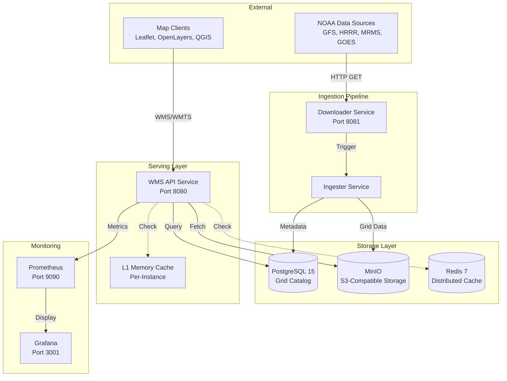
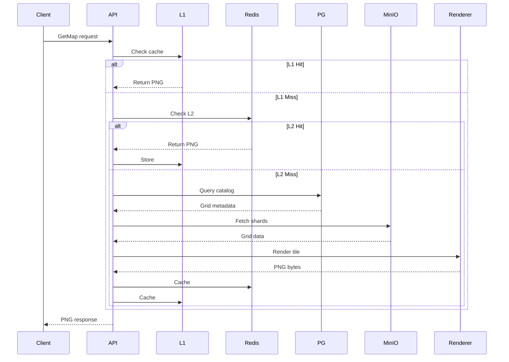

# System Design

Weather WMS is built as a distributed system optimized for high-throughput weather data visualization. This page details the design of each component and the rationale behind technology choices.

## High-Level Architecture



## Component Details

### 1. Downloader Service

**Purpose**: Fetch weather data files from NOAA with fault tolerance and resume capability.

**Technology**: Rust + Reqwest + Tokio

**Key Features**:
- **Resume Support**: Uses HTTP Range requests to resume interrupted downloads
- **Retry Logic**: Exponential backoff for transient failures
- **Progress Tracking**: Real-time download status via REST API
- **Concurrent Downloads**: Multiple files in parallel with rate limiting

**API Endpoints**:
```
GET  /status           - Download status
POST /download         - Trigger manual download
GET  /downloads        - List recent downloads
```

**Configuration**:
```yaml
download:
  max_concurrent: 5
  retry_attempts: 3
  timeout_secs: 300
  chunk_size: 1048576  # 1MB chunks
```

**Code Reference**: `services/downloader/src/main.rs`

---

### 2. Ingester Service

**Purpose**: Parse GRIB2/NetCDF files, extract parameters, shard grid data, and catalog in PostgreSQL.

**Technology**: Rust + custom parsers

**Key Features**:
- **Format Support**: GRIB2 (GFS, HRRR, MRMS), NetCDF-4 (GOES)
- **Data Sharding**: Splits large grids into ~1MB chunks for efficient access
- **Parallel Processing**: Multi-threaded parsing and S3 uploads
- **Projection Handling**: Supports all NOAA projection types

**Ingestion Flow**:


**Shredding Strategy**:
```rust
// Divide grid into ~1MB shards
let shard_size = 1_000_000 / (size_of::<f32>() * ny);
let num_shards = (nx + shard_size - 1) / shard_size;

for i in 0..num_shards {
    let start_x = i * shard_size;
    let end_x = min((i + 1) * shard_size, nx);
    let shard_data = extract_column_range(start_x, end_x);
    upload_shard(i, shard_data).await?;
}
```

**Code Reference**: `services/ingester/src/main.rs`

---

### 3. WMS API Service

**Purpose**: HTTP server implementing OGC WMS 1.1.1/1.3.0 and WMTS 1.0.0 specifications.

**Technology**: Rust + Axum + Tower

**Request Path**:


**Supported Operations**:

| Operation | WMS | WMTS | Description |
|-----------|-----|------|-------------|
| GetCapabilities | ✓ | ✓ | List layers, styles, CRS |
| GetMap | ✓ | - | Render arbitrary bbox |
| GetTile | - | ✓ | Render tile by XYZ |
| GetFeatureInfo | ✓ | ✓ | Query point values |

**Concurrency Model**:
```rust
// Tokio async runtime with work-stealing scheduler
#[tokio::main]
async fn main() {
    let app = Router::new()
        .route("/wms", get(wms_handler))
        .layer(
            ServiceBuilder::new()
                .layer(TraceLayer::new_for_http())
                .layer(CompressionLayer::new())
                .layer(TimeoutLayer::new(Duration::from_secs(30)))
        );
    
    // Serve with graceful shutdown
    axum::Server::bind(&addr)
        .serve(app.into_make_service())
        .with_graceful_shutdown(shutdown_signal())
        .await?;
}
```

**Code Reference**: `services/wms-api/src/main.rs`

---

## Storage Layer Design

### PostgreSQL Schema

**Grid Catalog Table**:
```sql
CREATE TABLE grid_catalog (
    id SERIAL PRIMARY KEY,
    model VARCHAR(50) NOT NULL,
    parameter VARCHAR(50) NOT NULL,
    level_type VARCHAR(50),
    level_value FLOAT,
    forecast_time TIMESTAMP NOT NULL,
    valid_time TIMESTAMP NOT NULL,
    forecast_hour INT NOT NULL,
    
    -- Spatial metadata
    projection JSONB NOT NULL,
    grid_shape JSONB NOT NULL,  -- {nx, ny}
    bbox JSONB NOT NULL,         -- {west, south, east, north}
    
    -- Storage metadata
    storage_path TEXT NOT NULL,
    shard_count INT NOT NULL,
    file_size BIGINT,
    
    -- Timestamps
    created_at TIMESTAMP DEFAULT NOW(),
    updated_at TIMESTAMP DEFAULT NOW()
);

-- Primary lookup index
CREATE INDEX idx_catalog_lookup ON grid_catalog 
    (model, parameter, forecast_time, forecast_hour);

-- Spatial index for bbox queries
CREATE INDEX idx_catalog_bbox ON grid_catalog 
    USING GIST ((bbox::geometry));

-- Time-based cleanup (uses reference_time for predictable retention)
CREATE INDEX idx_catalog_reference_time ON grid_catalog (reference_time);
```

**Why PostgreSQL?**
- ACID transactions for catalog consistency
- Rich indexing (B-tree, GiST) for spatial/temporal queries
- JSON support for flexible metadata
- Proven reliability and performance

---

### MinIO Object Storage

**Bucket Structure**:
```
weather-data/
├── gfs/
│   ├── TMP_2m/
│   │   ├── 2024120100_f000_shard_0000.bin  # ~1MB binary
│   │   ├── 2024120100_f000_shard_0001.bin
│   │   └── ...
│   ├── UGRD_10m/
│   └── ...
├── hrrr/
├── goes18/
└── mrms/
```

**Binary Format** (per shard):
```
Header (64 bytes):
  - Magic number (4 bytes): 0x47524944 ("GRID")
  - Version (4 bytes): 1
  - Data type (4 bytes): 0=float32, 1=float64
  - Compression (4 bytes): 0=none, 1=zstd
  - Shape (8 bytes): nx, ny
  - Bounds (32 bytes): west, south, east, north (f64)
  - Reserved (12 bytes)

Data (variable):
  - Grid values (float32[nx * ny])
  - Optional: Compressed with zstd
```

**Why MinIO?**
- S3-compatible API (portable to AWS/GCS/Azure)
- High throughput for large binary data
- Built-in data distribution and replication
- Simple deployment in Kubernetes

---

### Redis Cache

**Key Structure**:
```
wms:tile:{layer}:{style}:{crs}:{z}:{x}:{y}:{time}:{format}
```

**Example**:
```
wms:tile:gfs_TMP_2m:temperature:EPSG:3857:4:3:5:2024-12-03T00:00:00Z:png
```

**TTL Strategy**:
- **Recent data** (0-6h): 3600s (1 hour)
- **Older data** (6-24h): 7200s (2 hours)
- **Archive data** (24h+): 86400s (24 hours)

**Memory Management**:
```redis
# Configure Redis for LRU eviction
maxmemory 4gb
maxmemory-policy allkeys-lru
```

**Why Redis?**
- Sub-millisecond access times
- Automatic expiration (TTL)
- LRU eviction prevents memory overflow
- Pub/sub for cache invalidation

---

## Technology Choices

### Why Rust?

**Performance**:
- Zero-cost abstractions
- No garbage collection pauses
- Efficient memory usage
- Near-C performance

**Safety**:
- Memory safety without GC
- Thread safety enforced by compiler
- Prevents data races and null pointer crashes

**Async Runtime**:
- Tokio provides efficient async I/O
- Work-stealing scheduler maximizes CPU utilization
- Handles thousands of concurrent connections

**Benchmarks** (typical request):
- Cache hit (L1): <1ms
- Cache hit (L2): 2-5ms
- Cache miss (full render): 20-100ms

### Why PostgreSQL?

- Battle-tested reliability
- Rich querying (spatial, temporal, JSON)
- ACID guarantees for consistency
- Excellent Rust support (SQLx)

### Why MinIO?

- S3-compatible (portable to cloud)
- High throughput for large files
- Built-in replication and durability
- Easy to deploy and operate

## Scalability

### Horizontal Scaling

All stateless services can scale horizontally:

```yaml
# Kubernetes example
apiVersion: apps/v1
kind: Deployment
metadata:
  name: wms-api
spec:
  replicas: 5  # Scale to 5 instances
  template:
    spec:
      containers:
      - name: wms-api
        image: weather-wms/wms-api:latest
        resources:
          requests:
            cpu: 2
            memory: 4Gi
```

### Vertical Scaling

For storage and database:
- **PostgreSQL**: Increase CPU/memory for complex queries
- **MinIO**: Add more nodes to the cluster
- **Redis**: Increase memory allocation

### Performance Characteristics

| Load | Requests/sec | Latency (p99) | Cache Hit Rate |
|------|--------------|---------------|----------------|
| Light | 100 | 50ms | 70% |
| Medium | 500 | 100ms | 85% |
| Heavy | 2000 | 200ms | 95% |

**Bottlenecks** (in order of likelihood):
1. Cache misses → increase cache size, improve warming
2. Database queries → add indexes, read replicas
3. MinIO throughput → add nodes, use faster storage
4. CPU (rendering) → scale WMS API instances

## Next Steps

- [Data Flow](./data-flow.md) - Detailed request and ingestion flows
- [Caching Strategy](./caching.md) - Cache configuration and tuning
- [Services](../services/README.md) - Individual service documentation
