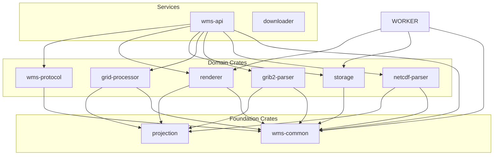

# Crates Overview

Weather WMS is built on a foundation of reusable Rust libraries (crates) that handle specific technical domains. This modular architecture allows code sharing between services and independent testing.

## Crate Dependency Graph



## Crate Catalog

| Crate | Purpose | Lines of Code | Dependencies |
|-------|---------|---------------|--------------|
| [grib2-parser](./grib2-parser.md) | Parse GRIB2 weather data files | ~2,500 | bytes, thiserror |
| [grid-processor](./grid-processor.md) | Zarr V3 grid storage with pyramids | ~4,000 | zarrs, object_store, ndarray |
| [netcdf-parser](./netcdf-parser.md) | Parse NetCDF-4 satellite data | ~800 | netcdf, ndarray |
| [projection](./projection.md) | Coordinate system transformations | ~1,200 | None (pure math) |
| [renderer](./renderer.md) | Weather visualization engine | ~3,000 | image, imageproc |
| [storage](./storage.md) | Storage abstractions (S3, Redis, DB) | ~2,000 | aws-sdk-s3, redis, sqlx |
| [wms-common](./wms-common.md) | Shared types and utilities | ~600 | serde, chrono |
| [wms-protocol](./wms-protocol.md) | OGC WMS/WMTS protocol implementation | ~1,000 | quick-xml, serde |

## Architecture Principles

### 1. **No External Projection Libraries**

We implement map projections from scratch for:
- **Control**: Full understanding of projection math
- **Performance**: Optimized for our use cases
- **Dependencies**: Reduce external dependencies
- **Correctness**: Match NOAA's projection definitions exactly

### 2. **Pure Rust GRIB2 Parser**

Unlike many weather systems that shell out to `wgrib2`, we parse GRIB2 directly in Rust:
- **No subprocess overhead**: 10-100x faster
- **Better error handling**: Type-safe parsing
- **Memory efficiency**: Stream-based parsing
- **Cross-platform**: No C dependencies

### 3. **Async-First Design**

All I/O operations are async:
- Storage crate uses async S3/Redis clients
- Allows concurrent operations without threads
- Efficient resource utilization with Tokio

### 4. **Type Safety**

Strong typing prevents common errors:
```rust
// Compiler enforces valid CRS codes
pub enum CRS {
    EPSG4326,   // Geographic
    EPSG3857,   // Web Mercator
    EPSG3413,   // Polar Stereographic (North)
}

// Can't mix coordinate systems
impl BoundingBox {
    pub fn new(west: f64, south: f64, east: f64, north: f64, crs: CRS) -> Self {
        // Validates bounds for CRS
    }
}
```

### 5. **Zero-Copy Where Possible**

Use `bytes::Bytes` for efficient data handling:
```rust
// Shares underlying buffer, no allocation
let data = Bytes::from(vec![1, 2, 3, 4]);
let slice = data.slice(1..3);  // Zero-copy slice
```

## Crate Details

### Data Format Crates

#### [grib2-parser](./grib2-parser.md)

Pure Rust GRIB2 (GRIB Edition 2) parser for GFS, HRRR, and MRMS data.

**Key Features**:
- Supports all NOAA GRIB2 templates
- Handles JPEG2000, PNG, and simple packing
- Streaming parser (low memory)
- Template-based message decoding

**Used by**: Ingester service

---

#### [netcdf-parser](./netcdf-parser.md)

NetCDF-4 parser specialized for GOES satellite data.

**Key Features**:
- Reads GOES-R ABI Level 2 products
- Geostationary projection support
- Fixed-grid navigation
- CF metadata conventions

**Used by**: Ingester service

---

### Projection Crate

#### [projection](./projection.md)

Coordinate reference system (CRS) transformations and map projections.

**Supported Projections**:
- Geographic (lat/lon)
- Mercator / Web Mercator (EPSG:3857)
- Lambert Conformal Conic
- Polar Stereographic
- Geostationary (GOES satellites)

**Used by**: All services for coordinate conversion

---

### Rendering Crate

#### [renderer](./renderer.md)

Weather data visualization engine that converts numeric grids to styled images.

**Rendering Types**:
- **Gradient/Color Ramp**: Temperature, pressure, humidity
- **Contour Lines**: Isobars, isotherms (marching squares algorithm)
- **Wind Barbs**: Vector wind visualization
- **Numeric Labels**: Point value annotations

**Output Formats**: PNG, JPEG

**Used by**: WMS API, Renderer Worker

---

### Storage Crate

#### [storage](./storage.md)

Unified storage abstractions for all persistence needs.

**Components**:
- `ObjectStorage`: MinIO/S3 operations
- `Catalog`: PostgreSQL metadata queries
- `TileCache`: Redis tile caching
- `TileMemoryCache`: In-memory LRU cache
- `GribCache`: In-memory GRIB file cache

**Used by**: All services

---

### Protocol Crate

#### [wms-protocol](./wms-protocol.md)

OGC Web Map Service and Web Map Tile Service protocol implementation.

**Features**:
- WMS 1.1.1 and 1.3.0
- WMTS 1.0.0 (KVP and RESTful)
- GetCapabilities XML generation
- Request parameter parsing and validation

**Used by**: WMS API service

---

### Common Crate

#### [wms-common](./wms-common.md)

Shared types, utilities, and error definitions.

**Key Types**:
- `BoundingBox`: Geographic extent
- `CRS`: Coordinate reference system enum
- `Layer`: Layer metadata
- `Style`: Visualization style definition
- `TileCoord`: XYZ tile coordinates
- `TimeRange`: Temporal extent

**Used by**: All services and crates

---

## Development Workflow

### Building a Crate

```bash
# Build single crate
cd crates/grib2-parser
cargo build --release

# Run tests
cargo test

# Run benchmarks
cargo bench

# Generate documentation
cargo doc --open
```

### Using a Crate in a Service

```toml
# Cargo.toml
[dependencies]
grib2-parser = { path = "../../crates/grib2-parser" }
projection = { path = "../../crates/projection" }
```

### Creating a New Crate

```bash
# Create workspace member
cargo new --lib crates/my-crate

# Add to workspace
# Edit root Cargo.toml:
[workspace]
members = [
    "crates/grib2-parser",
    "crates/my-crate",  # Add this
]
```

## Testing Strategy

### Unit Tests

Each crate has comprehensive unit tests:

```bash
# Run all crate tests
cargo test --workspace --lib

# Run specific crate tests
cargo test -p grib2-parser

# With coverage
cargo tarpaulin --workspace --lib
```

### Integration Tests

Test data files in `crates/*/tests/`:

```
crates/grib2-parser/tests/
├── data/
│   ├── gfs_sample.grib2
│   └── hrrr_sample.grib2
└── integration_test.rs
```

### Benchmarks

Performance benchmarks using Criterion:

```bash
# Run benchmarks
cargo bench -p renderer

# Compare results
cargo bench --bench rendering_benchmark -- --save-baseline before
# Make changes...
cargo bench --bench rendering_benchmark -- --baseline before
```

## Documentation

### Inline Documentation

All public APIs are documented with examples:

```rust
/// Parses a GRIB2 file and returns an iterator over messages.
///
/// # Example
///
/// ```
/// use grib2_parser::Grib2Reader;
/// let data = std::fs::read("file.grib2")?;
/// let reader = Grib2Reader::new(data.into());
/// for msg in reader.iter_messages() {
///     println!("{:?}", msg.product_definition);
/// }
/// ```
pub fn iter_messages(&self) -> impl Iterator<Item = Grib2Message> {
    // ...
}
```

### Generate Rustdoc

```bash
# Build documentation for all crates
cargo doc --workspace --no-deps --open
```

## Performance Characteristics

| Crate | Operation | Time | Notes |
|-------|-----------|------|-------|
| grib2-parser | Parse GFS file (100 MB) | ~2s | 50x faster than wgrib2 subprocess |
| netcdf-parser | Parse GOES file (50 MB) | ~500ms | Using netcdf-sys bindings |
| projection | Transform 1M points | ~50ms | SIMD-optimized math |
| renderer | Render 256×256 tile | ~5ms | Gradient style |
| renderer | Render with contours | ~50ms | Marching squares |
| storage | S3 shard fetch | ~20ms | 1 MB shard |
| storage | Redis cache hit | ~2ms | Network latency |

## Next Steps

Explore individual crate documentation:

- [grib2-parser](./grib2-parser.md) - GRIB2 format and parsing
- [netcdf-parser](./netcdf-parser.md) - NetCDF and GOES data
- [projection](./projection.md) - Map projections and CRS
- [renderer](./renderer.md) - Weather visualization
- [storage](./storage.md) - Storage abstractions
- [wms-common](./wms-common.md) - Shared types
- [wms-protocol](./wms-protocol.md) - OGC protocols
