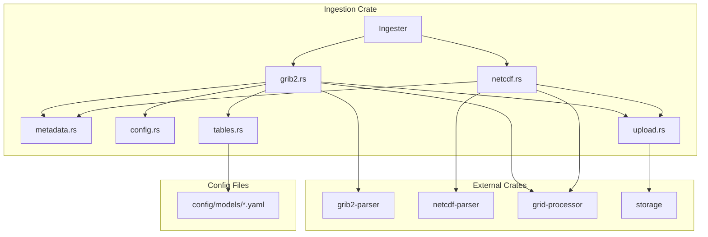

# Ingestion Crate

The `ingestion` crate provides core logic for parsing weather data files (GRIB2 and NetCDF), converting them to Zarr V3 format with multi-resolution pyramids, and storing them in object storage.

## Overview

**Location**: `crates/ingestion/`  
**Purpose**: Reusable ingestion logic shared between services  
**Dependencies**: grib2-parser, netcdf-parser, grid-processor, storage, projection

## Architecture



## Public API

### Ingester

The main entry point for ingestion:

```rust
use ingestion::{Ingester, IngestOptions, IngestionResult};
use storage::{Catalog, ObjectStorage};

// Create ingester with storage connections
let storage = Arc::new(ObjectStorage::new(&config)?);
let catalog = Catalog::connect(&database_url).await?;
let ingester = Ingester::new(storage, catalog);

// Ingest a file
let options = IngestOptions {
    model: Some("gfs".to_string()),
    forecast_hour: Some(3),
};

let result = ingester.ingest_file("/data/downloads/gfs.grib2", options).await?;

println!("Registered {} datasets for model {}", 
         result.datasets_registered, result.model);
println!("Parameters: {:?}", result.parameters);
```

### IngestOptions

Options for controlling ingestion behavior:

```rust
pub struct IngestOptions {
    /// Model name override (auto-detected from filename if None)
    pub model: Option<String>,
    
    /// Forecast hour override (auto-detected from filename if None)
    pub forecast_hour: Option<u32>,
}
```

### IngestionResult

Result returned after successful ingestion:

```rust
pub struct IngestionResult {
    /// Number of datasets registered in catalog
    pub datasets_registered: usize,
    
    /// Model name (detected or specified)
    pub model: String,
    
    /// Reference time from data file
    pub reference_time: DateTime<Utc>,
    
    /// List of parameters ingested
    pub parameters: Vec<String>,
    
    /// Total bytes written to storage
    pub bytes_written: u64,
}
```

## Modules

### grib2.rs - GRIB2 Ingestion

Handles GRIB2 file ingestion for GFS, HRRR, and MRMS data:

```rust
pub async fn ingest_grib2(
    storage: &ObjectStorage,
    catalog: &Catalog,
    data: Bytes,
    options: &IngestOptions,
) -> Result<IngestionResult, IngestionError>
```

**Features**:
- Parses GRIB2 messages using `grib2-parser`
- **Config-driven parameter names**: Loads `Grib2Tables` from model YAML configs
- Filters parameters based on configuration
- Converts sentinel values (e.g., -999) to NaN
- Writes Zarr arrays with pyramids
- Handles Lambert Conformal (HRRR) and Lat/Lon (GFS) projections

### tables.rs - GRIB2 Tables and Ingestion Filter

Builds both `Grib2Tables` (parameter naming) and `IngestionFilter` (parameter filtering) from model YAML configs.

#### GRIB2 Tables (Parameter Naming)

Maps GRIB2 numeric codes to human-readable parameter names:

```rust
/// Build tables from all model configs in config/models/
pub fn build_tables_from_configs() -> Arc<Grib2Tables>;

/// Build tables for a specific model only
pub fn build_tables_for_model(model: &str) -> Arc<Grib2Tables>;
```

#### Ingestion Filter (Parameter Filtering)

Determines which parameter/level combinations to ingest:

```rust
/// Build an ingestion filter from a model's YAML configuration.
/// Fails fast if config is missing or invalid.
pub fn build_filter_for_model(model: &str) -> Result<Arc<IngestionFilter>, IngestionError>;
```

**How it works**:
1. Reads YAML files from `config/models/` directory (or `CONFIG_DIR` env var)
2. For tables: extracts `grib2:` sections to map (discipline, category, number) → parameter name
3. For filter: extracts `levels[].level_code` and `value`/`values` to determine what to ingest
4. Returns `Arc`-wrapped instances for sharing across the application

**Example YAML parsed**:
```yaml
parameters:
  - name: TMP
    grib2:
      discipline: 0
      category: 0
      number: 0
    levels:
      - level_code: 103
        value: 2                    # Filter: only 2m
        display: "2 m above ground" # Tables: display text
      - level_code: 100
        values: [1000, 850, 500]    # Filter: only these pressure levels
        display_template: "{value} mb"
```

### netcdf.rs - NetCDF Ingestion

Handles NetCDF file ingestion for GOES satellite data:

```rust
pub async fn ingest_netcdf(
    storage: &ObjectStorage,
    catalog: &Catalog,
    data: Bytes,
    options: &IngestOptions,
) -> Result<IngestionResult, IngestionError>
```

**Features**:
- Parses GOES-R ABI Level 2 products
- Extracts observation time from filename
- Maps band numbers to parameter names
- Reprojects from geostationary to lat/lon grid

### metadata.rs - File Metadata Extraction

Utilities for extracting metadata from filenames:

```rust
/// Detect file type from path/extension
pub fn detect_file_type(path: &str) -> FileType;

/// Extract model name from filename
pub fn extract_model_from_filename(path: &str) -> Option<String>;

/// Extract forecast hour from filename
pub fn extract_forecast_hour_from_filename(path: &str) -> Option<u32>;

/// Extract MRMS parameter name from filename
pub fn extract_mrms_param_from_filename(path: &str) -> Option<String>;

/// Parse GOES filename for satellite, band, and observation time
pub fn parse_goes_filename(filename: &str) -> Option<GoesMetadata>;
```

**Supported filename patterns**:
```
gfs_20241217_12z_f003.grib2     → model="gfs", forecast_hour=3
hrrr_conus_20241217_12z_f001.grib2 → model="hrrr", forecast_hour=1
MRMS_SeamlessHSR_00.00_20241217-120000.grib2.gz → model="mrms", param="REFL"
OR_ABI-L2-CMIPF-M6C13_G18_s20251190001170.nc → model="goes18", band=13
```

### Parameter Filtering (Config-Driven)

Which parameters are ingested is determined by the `parameters` section in each model's YAML config file (`config/models/*.yaml`). This is the same configuration used to define WMS/WMTS layers, ensuring consistency between what's ingested and what's available for rendering.

```rust
/// Build an ingestion filter from a model's YAML configuration.
/// Returns an error if the config is missing or invalid (fail-fast).
pub fn build_filter_for_model(model: &str) -> Result<Arc<IngestionFilter>, IngestionError>;

/// Check if a parameter/level combination should be ingested.
impl IngestionFilter {
    pub fn should_ingest(&self, param: &str, level_type: u8, level_value: u32) -> bool;
}
```

**Level specifications in YAML:**

| YAML Pattern | Meaning |
|--------------|---------|
| `value: 2` | Only ingest this specific value (e.g., 2m) |
| `values: [1000, 850, 500]` | Ingest any of these values |
| *(no value/values)* | Ingest all values for this level type |

**Example from `config/models/gfs.yaml`:**

```yaml
parameters:
  - name: TMP
    grib2:
      discipline: 0
      category: 0
      number: 0
    levels:
      - level_code: 103
        value: 2                    # Only 2m temperature
      - level_code: 100
        values: [1000, 850, 500, 300, 250, 200]  # Selected pressure levels
  
  - name: TCDC
    levels:
      - level_code: 200             # All values (entire atmosphere)
```

**Fail-fast behavior:** If a model's config file is missing or has no parameters defined, ingestion fails with a critical error. This ensures users explicitly configure which parameters to ingest for each model.

**To add a new parameter:** Edit the model's YAML file in `config/models/` and restart the ingester service.

### upload.rs - Storage Upload

Uploads Zarr directories to object storage:

```rust
/// Upload a local Zarr directory to MinIO
pub async fn upload_zarr_directory(
    storage: &ObjectStorage,
    local_path: &Path,
    storage_prefix: &str,
) -> Result<u64, IngestionError>
```

**Features**:
- Recursive directory traversal
- Preserves Zarr structure
- Returns total bytes uploaded
- Async streaming upload

### error.rs - Error Types

```rust
#[derive(Debug, thiserror::Error)]
pub enum IngestionError {
    #[error("File not found: {0}")]
    FileNotFound(String),
    
    #[error("Unsupported file type: {0}")]
    UnsupportedFileType(String),
    
    #[error("Parse error: {0}")]
    ParseError(String),
    
    #[error("Storage error: {0}")]
    StorageError(#[from] storage::Error),
    
    #[error("Catalog error: {0}")]
    CatalogError(#[from] sqlx::Error),
    
    #[error("IO error: {0}")]
    IoError(#[from] std::io::Error),
}
```

## Usage in Ingester Service

The ingester service uses this crate:

```rust
// services/ingester/src/main.rs
use ingestion::{Ingester, IngestOptions};

let ingester = Ingester::new(storage, catalog);

// HTTP handler
async fn ingest_handler(
    ingester: &Ingester,
    request: IngestRequest,
) -> Result<IngestResponse, Error> {
    let options = IngestOptions {
        model: request.model,
        forecast_hour: request.forecast_hour,
    };
    
    let result = ingester.ingest_file(&request.file_path, options).await?;
    
    Ok(IngestResponse {
        success: true,
        datasets_registered: result.datasets_registered,
        model: Some(result.model),
        reference_time: Some(result.reference_time.to_rfc3339()),
        parameters: result.parameters,
    })
}
```

## Zarr Output Format

The crate writes Zarr V3 arrays with multi-resolution pyramids:

```
grids/gfs/20241217_12z/tmp_2_m_above_ground_f003.zarr/
├── zarr.json                    # Root group metadata (OME-NGFF multiscale)
├── 0/                           # Level 0: Full resolution
│   ├── zarr.json               # Array metadata
│   └── c/                      # Sharded chunks
│       ├── 0/0                 # Chunk (0,0)
│       └── ...
├── 1/                           # Level 1: 2x downsampled
│   ├── zarr.json
│   └── c/...
└── 2/                           # Level 2: 4x downsampled (if large enough)
    ├── zarr.json
    └── c/...
```

**Metadata includes**:
- Grid dimensions and bounding box
- Model, parameter, level information
- Reference time and forecast hour
- Compression settings (Blosc LZ4)
- Pyramid level scales

## Configuration

Environment variables affecting ingestion:

```bash
# Pyramid generation
ZARR_PYRAMID_LEVELS=2           # Number of downsampled levels
ZARR_CHUNK_SIZE=512             # Chunk size in pixels

# Config directory (for GRIB2 parameter tables)
CONFIG_DIR=/app/config          # Path to config directory containing models/
```

### GRIB2 Parameter Configuration

Parameter names and level descriptions are loaded from model YAML files at `config/models/*.yaml`. See [Model Configuration](../configuration/models.md) for details.

Key fields used by the tables builder:
- `parameters[].name` - Parameter short name (e.g., "TMP", "UGRD")
- `parameters[].grib2.discipline` - GRIB2 discipline code
- `parameters[].grib2.category` - GRIB2 category code
- `parameters[].grib2.number` - GRIB2 parameter number
- `parameters[].levels[].level_code` - GRIB2 level type code
- `parameters[].levels[].display` - Static level description
- `parameters[].levels[].display_template` - Level description with `{value}` placeholder

## Testing

```bash
# Run unit tests
cargo test -p ingestion

# Run with test data
cargo test -p ingestion -- --ignored  # Requires test data files
```

## Performance

| Operation | Data Size | Time |
|-----------|-----------|------|
| Parse GRIB2 (GFS) | 550 MB | ~2s |
| Write Zarr + pyramids | 50 params | ~25s |
| Upload to MinIO | ~100 MB | ~3s |
| **Total GFS file** | 550 MB | ~30s |

| Operation | Data Size | Time |
|-----------|-----------|------|
| Parse MRMS | 3 MB | ~50ms |
| Write Zarr + pyramids | 1 param | ~200ms |
| Upload to MinIO | ~8 MB | ~100ms |
| **Total MRMS file** | 3 MB | ~400ms |

## Next Steps

- [Ingester Service](../services/ingester.md) - HTTP service using this crate
- [grid-processor](./grid-processor.md) - Zarr writing details
- [grib2-parser](./grib2-parser.md) - GRIB2 parsing details
- [netcdf-parser](./netcdf-parser.md) - NetCDF parsing details
