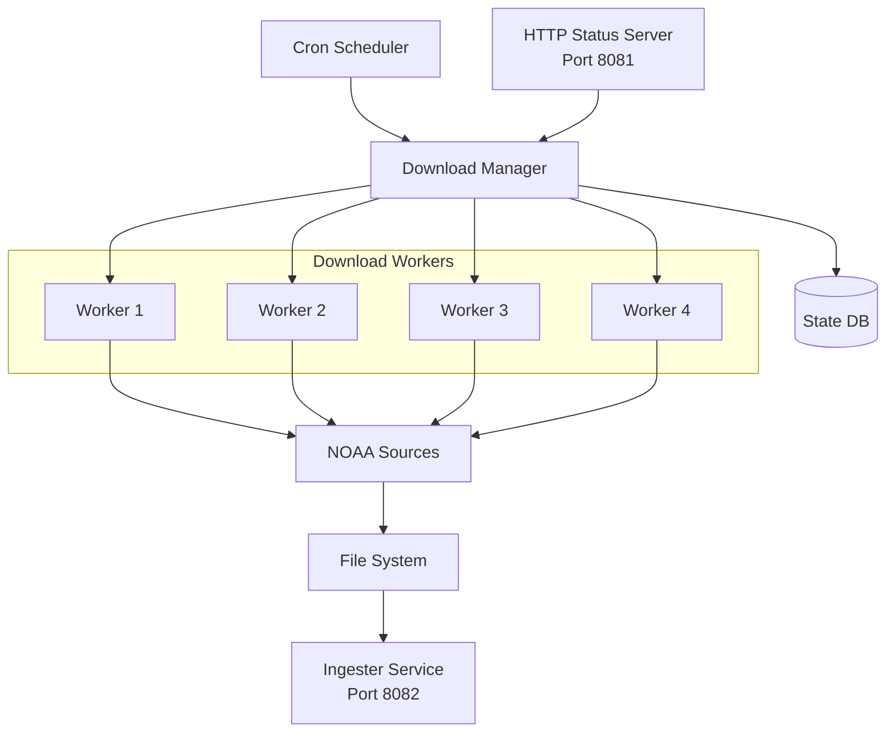

# Downloader Service

The Downloader service fetches weather data files from NOAA sources with robust error handling, resume capability, and automatic ingestion triggering.

## Overview

**Location**: `services/downloader/`  
**Language**: Rust  
**Port**: 8081 (HTTP status API)  
**Scaling**: Horizontal

## Responsibilities

1. **Data Fetching**: Downloads GRIB2 and NetCDF files from NOAA
2. **Resume Support**: HTTP Range requests for interrupted downloads
3. **Retry Logic**: Exponential backoff for transient failures
4. **Progress Tracking**: Persistent state across restarts
5. **Ingestion Trigger**: Notifies [Ingester Service](./ingester.md) when downloads complete
6. **Status API**: HTTP endpoints for monitoring and control

## Architecture



## Data Sources

The downloader supports multiple NOAA data sources:

### GFS (Global Forecast System)

**Source**: NOMADS (https://nomads.ncep.noaa.gov)

**URL Pattern**:
```
https://nomads.ncep.noaa.gov/pub/data/nccf/com/gfs/prod/gfs.{YYYYMMDD}/{HH}/atmos/gfs.t{HH}z.pgrb2.0p25.f{FFF}
```

**Example**:
```
https://nomads.ncep.noaa.gov/pub/data/nccf/com/gfs/prod/gfs.20241203/00/atmos/gfs.t00z.pgrb2.0p25.f000
```

**Schedule**: Every 6 hours (00, 06, 12, 18 UTC)  
**Forecast Hours**: 0-384 (every 3h for first 120h, every 12h after)  
**File Size**: ~100-150 MB per file

---

### HRRR (High-Resolution Rapid Refresh)

**Source**: NOMADS

**URL Pattern**:
```
https://nomads.ncep.noaa.gov/pub/data/nccf/com/hrrr/prod/hrrr.{YYYYMMDD}/conus/hrrr.t{HH}z.wrfsfcf{FF}.grib2
```

**Schedule**: Hourly  
**Forecast Hours**: 0-48  
**File Size**: ~200-300 MB per file

---

### MRMS (Multi-Radar Multi-Sensor)

**Source**: AWS S3 (NOAA Open Data - `noaa-mrms-pds`)

**S3 Path Pattern**:
```
s3://noaa-mrms-pds/CONUS/{PRODUCT}/{YYYYMMDD}/MRMS_{PRODUCT}_{YYYYMMDD}-{HHMMSS}.grib2.gz
```

**Products**:
- `MergedReflectivityQCComposite` - Radar reflectivity
- `PrecipRate` - Precipitation rate

**Schedule**: Every 2 minutes  
**File Size**: ~10-30 MB (compressed)

#### Efficient S3 Discovery

MRMS uses `start_after` to efficiently list only recent files within the lookback period:

```rust
// Skip to files from the lookback start time
let start_after = format!(
    "CONUS/{}/{}/MRMS_{}_{}",
    product, date_str, product,
    earliest_time.format("%Y%m%d-%H%M00")
);
```

---

### GOES-16/18 (Geostationary Satellites)

**Source**: AWS S3 (NOAA Open Data)

**URL Pattern**:
```
https://noaa-goes{SATELLITE}.s3.amazonaws.com/ABI-L2-CMIPC/{YYYY}/{DDD}/{HH}/OR_ABI-L2-CMIPC-M6C{CHANNEL}_G{SATELLITE}_s{START}_e{END}_c{CREATED}.nc
```

**Channels**: C01-C16 (various wavelengths)  
**Schedule**: Every 5 minutes (CONUS sector)  
**File Size**: ~40-60 MB per file

#### Efficient S3 Discovery

GOES files are stored in S3 buckets organized by hour, with files from all 16 channels and both satellites mixed together. To efficiently discover files for a specific band (e.g., C13) without listing all files:

```rust
// Use S3 start_after to skip directly to target band+satellite
// Files are sorted lexicographically: C01 < C02 < ... < C13 < C14 ...
let start_after = format!(
    "{}/OR_{}-M6C{:02}_G{}_",
    prefix, product, band, satellite_num
);

// This jumps directly to files matching the band, avoiding listing C01-C12
s3_client.list_objects_v2()
    .prefix(&prefix)
    .start_after(&start_after)
    .max_keys(max_results)
    .send()
```

This optimization reduces S3 API calls and ensures all timesteps (~12 per hour at 5-minute intervals) are discovered for each configured band.

## Download Flow

### 1. Schedule Trigger

**Cron-based scheduling**:
```rust
let schedule = Schedule::from_str("0 */6 * * *")?;  // Every 6 hours

for datetime in schedule.upcoming(Utc) {
    let model = "gfs";
    let cycle = datetime.format("%H").to_string();
    
    download_manager.enqueue_download(model, cycle).await?;
}
```

**Manual trigger**:
```bash
curl -X POST http://localhost:8081/download \
  -H "Content-Type: application/json" \
  -d '{"model": "gfs", "cycle": "00"}'
```

---

### 2. Download Job Creation

```rust
struct DownloadJob {
    id: Uuid,
    model: String,
    cycle: String,
    forecast_hour: u32,
    url: String,
    destination: PathBuf,
    state: DownloadState,
    attempts: u32,
    bytes_downloaded: u64,
    total_bytes: Option<u64>,
    created_at: DateTime<Utc>,
    updated_at: DateTime<Utc>,
}

enum DownloadState {
    Pending,
    InProgress,
    Completed,
    Failed,
    Retrying,
}
```

---

### 3. Resumable Download

**HTTP Range Request**:
```rust
async fn download_with_resume(
    url: &str,
    dest: &Path,
    state: &mut DownloadState,
) -> Result<()> {
    let client = reqwest::Client::new();
    
    // Check existing file
    let downloaded = if dest.exists() {
        dest.metadata()?.len()
    } else {
        0
    };
    
    state.bytes_downloaded = downloaded;
    
    // Build request with Range header
    let mut request = client.get(url);
    
    if downloaded > 0 {
        request = request.header("Range", format!("bytes={}-", downloaded));
        info!(bytes = downloaded, "Resuming download");
    }
    
    let mut response = request.send().await?;
    
    // Get total size from Content-Length or Content-Range
    if let Some(content_length) = response.content_length() {
        state.total_bytes = Some(content_length + downloaded);
    }
    
    // Open file for appending
    let mut file = OpenOptions::new()
        .create(true)
        .append(true)
        .open(dest)?;
    
    // Stream download with progress updates
    let mut stream = response.bytes_stream();
    while let Some(chunk) = stream.next().await {
        let chunk = chunk?;
        file.write_all(&chunk)?;
        
        state.bytes_downloaded += chunk.len() as u64;
        state.save()?;  // Persist progress
    }
    
    file.flush()?;
    Ok(())
}
```

---

### 4. Retry Logic

**Exponential backoff**:
```rust
async fn download_with_retry(
    url: &str,
    dest: &Path,
    max_retries: u32,
) -> Result<()> {
    let mut attempts = 0;
    let mut delay = Duration::from_secs(1);
    
    loop {
        match download_with_resume(url, dest, &mut state).await {
            Ok(_) => return Ok(()),
            Err(e) if attempts < max_retries => {
                attempts += 1;
                warn!(
                    error = %e,
                    attempt = attempts,
                    delay_secs = delay.as_secs(),
                    "Download failed, retrying"
                );
                
                tokio::time::sleep(delay).await;
                delay *= 2;  // Exponential backoff
            }
            Err(e) => return Err(e),
        }
    }
}
```

**Retry schedule**:
- Attempt 1: Immediate
- Attempt 2: Wait 1s
- Attempt 3: Wait 2s
- Attempt 4: Wait 4s
- Attempt 5: Wait 8s
- Give up after 5 attempts

---

### 5. Ingestion Trigger

After successful download, the downloader sends a request to the [Ingester Service](./ingester.md):

```rust
async fn trigger_ingestion(
    ingester_url: &str,  // http://ingester:8082/ingest
    file_path: &Path,
    model: &str,
) -> Result<()> {
    let client = reqwest::Client::new();
    
    let request_body = serde_json::json!({
        "file_path": file_path.to_string_lossy(),
        "model": model,
    });
    
    let response = client
        .post(ingester_url)  // POST http://ingester:8082/ingest
        .json(&request_body)
        .send()
        .await?;
    
    if response.status().is_success() {
        info!(
            model = model,
            path = %file_path.display(),
            "Triggered ingestion"
        );
        Ok(())
    } else {
        Err(anyhow!("Ingestion trigger failed: {}", response.status()))
    }
}
```

## HTTP API

### Status Server (Port 8081)

#### Health Check
```http
GET /health
```

**Response**:
```json
{"status": "ok"}
```

---

#### Get Download Status
```http
GET /status
```

**Response**:
```json
{
  "active_downloads": 3,
  "pending_downloads": 12,
  "completed_today": 48,
  "failed_today": 2,
  "downloads": [
    {
      "id": "550e8400-e29b-41d4-a716-446655440000",
      "model": "gfs",
      "cycle": "00",
      "forecast_hour": 12,
      "state": "in_progress",
      "progress": 0.65,
      "bytes_downloaded": 65000000,
      "total_bytes": 100000000,
      "attempts": 1,
      "created_at": "2024-12-03T18:00:00Z"
    }
  ]
}
```

---

#### Trigger Download
```http
POST /download
Content-Type: application/json

{
  "model": "gfs",
  "cycle": "00",
  "forecast_hours": [0, 3, 6]
}
```

**Response**:
```json
{
  "queued": 3,
  "jobs": [
    {"id": "...", "model": "gfs", "forecast_hour": 0},
    {"id": "...", "model": "gfs", "forecast_hour": 3},
    {"id": "...", "model": "gfs", "forecast_hour": 6}
  ]
}
```

---

#### Get Download Details
```http
GET /download/{job_id}
```

**Response**:
```json
{
  "id": "550e8400-e29b-41d4-a716-446655440000",
  "model": "gfs",
  "cycle": "00",
  "forecast_hour": 12,
  "url": "https://nomads.ncep.noaa.gov/...",
  "destination": "/data/downloads/gfs.t00z.pgrb2.0p25.f012",
  "state": "completed",
  "bytes_downloaded": 100000000,
  "total_bytes": 100000000,
  "attempts": 1,
  "created_at": "2024-12-03T18:00:00Z",
  "completed_at": "2024-12-03T18:02:34Z",
  "duration_seconds": 154
}
```

---

#### Cancel Download
```http
DELETE /download/{job_id}
```

---

#### List Recent Downloads
```http
GET /downloads?limit=50&state=completed
```

**Query Parameters**:
- `limit`: Max results (default: 100)
- `state`: Filter by state (pending, in_progress, completed, failed)
- `model`: Filter by model

## Configuration

### Environment Variables

```bash
# Directories
TEMP_DIR=/tmp/weather-downloads       # Temporary downloads
OUTPUT_DIR=/data/downloads            # Completed files
STATE_DIR=/data/downloader            # State database

# Download settings
MAX_CONCURRENT_DOWNLOADS=4            # Parallel downloads
MAX_RETRIES=5                         # Retry attempts
DOWNLOAD_TIMEOUT_SECS=300             # Per-file timeout

# Ingestion
INGESTER_URL=http://ingester:8082/ingest  # Ingester service URL for triggering ingestion

# HTTP server
STATUS_PORT=8081                      # Status API port

# Logging
RUST_LOG=info
```

### Model Configuration

```yaml
# config/models/gfs.yaml
downloads:
  source: nomads
  url_template: "https://nomads.ncep.noaa.gov/pub/data/nccf/com/gfs/prod/gfs.{date}/{cycle}/atmos/gfs.t{cycle}z.pgrb2.0p25.f{hour:03d}"
  schedule: "0 */6 * * *"  # Cron expression
  forecast_hours: [0, 3, 6, 9, ..., 384]
  retention_hours: 168  # Keep for 7 days
```

## Performance

### Throughput

| Model | File Size | Files/Cycle | Download Time | Total Time |
|-------|-----------|-------------|---------------|------------|
| GFS | 100 MB | 129 files | ~30s each | ~1 hour |
| HRRR | 250 MB | 49 files | ~1min each | ~50 min |
| MRMS | 20 MB | 1 file | ~5s | ~5s |
| GOES | 50 MB | 16 channels | ~15s each | ~4 min |

With 4 concurrent downloads: **~25-30 GB/hour throughput**

### Network Usage

- **Peak**: ~400 Mbps during GFS/HRRR cycles
- **Average**: ~50-100 Mbps continuous
- **Daily**: ~500 GB - 1 TB

## Monitoring

### Logs

```json
{
  "timestamp": "2024-12-03T18:30:00Z",
  "level": "INFO",
  "target": "downloader::download",
  "message": "Download started",
  "job_id": "550e8400-e29b-41d4-a716-446655440000",
  "model": "gfs",
  "url": "https://nomads.ncep.noaa.gov/..."
}
```

```json
{
  "timestamp": "2024-12-03T18:32:34Z",
  "level": "INFO",
  "target": "downloader::download",
  "message": "Download completed",
  "job_id": "550e8400-e29b-41d4-a716-446655440000",
  "bytes": 100000000,
  "duration_ms": 154000
}
```

### Metrics

Query download statistics:

```bash
# Recent downloads
curl http://localhost:8081/downloads?limit=10

# Success rate
curl http://localhost:8081/status | jq '.completed_today / (.completed_today + .failed_today)'
```

## Troubleshooting

### Downloads Failing

**Symptom**: All downloads failing immediately

**Causes**:
- NOAA source unavailable
- Network connectivity issues
- Invalid URLs

**Solution**:
```bash
# Test connectivity
curl -I https://nomads.ncep.noaa.gov

# Check logs
docker-compose logs downloader | grep ERROR

# Manually test URL
curl -O "https://nomads.ncep.noaa.gov/pub/data/nccf/com/gfs/prod/gfs.20241203/00/atmos/gfs.t00z.pgrb2.0p25.f000"
```

---

### Slow Downloads

**Symptom**: Downloads taking >5 minutes

**Causes**:
- Network bandwidth limit
- NOAA server slow
- Too many concurrent downloads

**Solution**:
```bash
# Reduce concurrency
MAX_CONCURRENT_DOWNLOADS=2

# Check network speed
speedtest-cli

# Monitor bandwidth
docker stats downloader
```

---

### Disk Full

**Symptom**: "No space left on device"

**Causes**:
- Insufficient disk space
- Old files not cleaned up

**Solution**:
```bash
# Check disk usage
df -h /data/downloads

# Clean old files
find /data/downloads -name "*.grib2" -mtime +7 -delete

# Configure retention
RETENTION_DAYS=3
```

## Next Steps

- [Ingester Service](./ingester.md) - Data ingestion after download
- [Data Sources](../data-sources/README.md) - Supported NOAA data sources
- [Deployment](../deployment/README.md) - Production deployment
