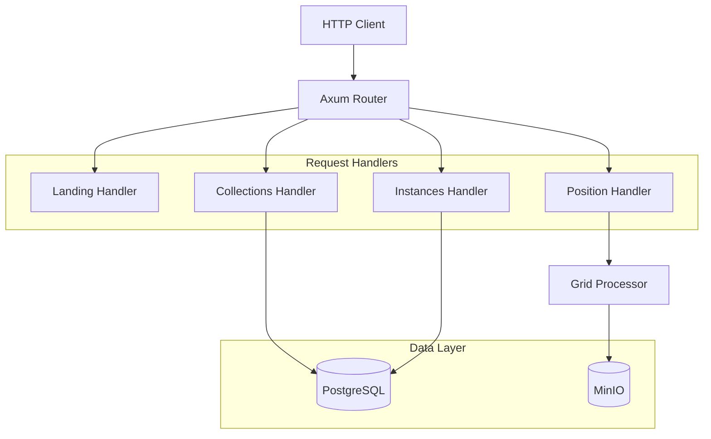

# EDR API Service

The EDR API service implements the OGC API - Environmental Data Retrieval specification, providing point-based and area-based data queries for weather model data.

## Overview

**Location**: `services/edr-api/`  
**Language**: Rust  
**Framework**: Axum (async web framework)  
**Port**: 8083 (configurable)  
**Scaling**: Horizontal

## Responsibilities

1. **OGC Compliance**: Implements EDR v1.1 specification with conformance testing
2. **Data Queries**: Supports position queries returning CoverageJSON
3. **Collection Management**: Exposes weather data collections grouped by level type
4. **Instance Support**: Provides access to specific model runs as instances
5. **Response Limits**: Enforces configurable limits to prevent resource exhaustion
6. **Metrics**: Exposes Prometheus metrics for monitoring

## Architecture



## Endpoints

### Discovery Endpoints

| Endpoint | Method | Description |
|----------|--------|-------------|
| `/edr` | GET | Landing page with API links |
| `/edr/conformance` | GET | Supported conformance classes |

### Collection Endpoints

| Endpoint | Method | Description |
|----------|--------|-------------|
| `/edr/collections` | GET | List all collections |
| `/edr/collections/{id}` | GET | Collection metadata |
| `/edr/collections/{id}/instances` | GET | List model run instances |
| `/edr/collections/{id}/instances/{instId}` | GET | Instance metadata |

### Query Endpoints

| Endpoint | Method | Description |
|----------|--------|-------------|
| `/edr/collections/{id}/position` | GET | Position query (latest run) |
| `/edr/collections/{id}/instances/{instId}/position` | GET | Position query (specific run) |

### Operations Endpoints

| Endpoint | Method | Description |
|----------|--------|-------------|
| `/health` | GET | Basic health check |
| `/ready` | GET | Readiness check (DB connectivity) |
| `/metrics` | GET | Prometheus metrics |

## Configuration

### Environment Variables

```bash
# Server
EDR_LISTEN_ADDR=0.0.0.0:8083     # Listen address
EDR_BASE_URL=http://localhost:8083/edr  # Base URL for links

# Database
DATABASE_URL=postgresql://...     # PostgreSQL connection

# Object Storage
S3_ENDPOINT=http://minio:9000    # MinIO/S3 endpoint
S3_BUCKET=weather-data           # Bucket name
S3_ACCESS_KEY=minioadmin         # Access key
S3_SECRET_KEY=minioadmin         # Secret key

# Performance
EDR_CHUNK_CACHE_MB=256           # Grid processor chunk cache

# Logging
RUST_LOG=info                    # Log level
```

### Collection Configuration

Collections are defined in YAML files under `config/edr/`:

```yaml
# config/edr/hrrr.yaml
model: hrrr

collections:
  - id: hrrr-isobaric
    title: "HRRR - Isobaric Levels"
    description: "Upper-air parameters on pressure levels"
    level_filter:
      level_type: isobaric
      level_code: 100
    parameters:
      - name: TMP
        levels: [850, 700, 500, 300, 250]
      - name: UGRD
        levels: [850, 700, 500]
    run_mode: instances

settings:
  output_formats:
    - application/vnd.cov+json
  default_crs: "CRS:84"
  supported_crs:
    - "CRS:84"
    - "EPSG:4326"

limits:
  max_parameters_per_request: 10
  max_time_steps: 48
  max_vertical_levels: 20
  max_response_size_mb: 50
```

### Configuration Hot-Reload

The EDR configuration can be reloaded without restarting the service by calling:

```bash
curl -X POST http://localhost:8083/api/config/reload
```

## Code Structure

```
services/edr-api/src/
├── main.rs                 # Entry point, server setup
├── lib.rs                  # Module exports
├── state.rs                # Application state (catalog, grid-processor)
├── config.rs               # EDR config loading
├── limits.rs               # Response size estimation
├── handlers/
│   ├── mod.rs              # Handler module exports
│   ├── landing.rs          # Landing page handler
│   ├── conformance.rs      # Conformance handler
│   ├── collections.rs      # Collections handlers
│   ├── instances.rs        # Instances handlers
│   ├── position.rs         # Position query handler
│   └── health.rs           # Health/metrics handlers
└── Dockerfile
```

## Dependencies

Key crates used:

- **edr-protocol** - EDR types, CoverageJSON, query parsing
- **grid-processor** - Weather data access and interpolation
- **storage** - Catalog and metadata queries
- **axum** - HTTP framework
- **tokio** - Async runtime

## Response Formats

### CoverageJSON

The primary response format for data queries:

```json
{
  "type": "Coverage",
  "domain": {
    "type": "Domain",
    "domainType": "Point",
    "axes": {
      "x": {"values": [-97.5]},
      "y": {"values": [35.2]},
      "t": {"values": ["2024-12-29T12:00:00Z"]}
    }
  },
  "parameters": {
    "TMP": {
      "type": "Parameter",
      "observedProperty": {"label": {"en": "Temperature"}},
      "unit": {"symbol": "K"}
    }
  },
  "ranges": {
    "TMP": {
      "type": "NdArray",
      "dataType": "float",
      "values": [288.5]
    }
  }
}
```

## Performance

### Caching Strategy

- **Chunk Cache**: Grid processor maintains a shared chunk cache for Zarr data
- **No Response Cache**: EDR responses are not cached (point queries are fast)

### Throughput

| Scenario | Requests/sec | Latency (p99) |
|----------|--------------|---------------|
| Position (1 param) | 500+ | <50ms |
| Position (10 params) | 200 | <100ms |

### Scaling

The service can be horizontally scaled. Each instance maintains its own chunk cache but shares the same database and storage.

## Monitoring

### Key Metrics

```
# Request counts
edr_requests_total{endpoint="position"}

# Latency
edr_request_duration_seconds_bucket{endpoint="position",le="0.1"}

# Cache performance
grid_processor_chunk_cache_hits_total
grid_processor_chunk_cache_misses_total
```

## Troubleshooting

### High Latency

**Symptoms**: Position queries taking >100ms

**Causes**:
1. Cold chunk cache
2. Large number of parameters requested
3. Database slow

**Solutions**:
- Increase chunk cache size
- Limit parameters per request
- Check database connectivity

### Memory Usage

**Symptoms**: High memory consumption

**Causes**:
1. Chunk cache too large
2. Many concurrent large queries

**Solutions**:
- Reduce `EDR_CHUNK_CACHE_MB`
- Lower response size limits in config

## See Also

- [EDR Endpoints](../api-reference/edr.md) - API documentation
- [edr-protocol Crate](../crates/edr-protocol.md) - Protocol types
- [grid-processor](../crates/grid-processor.md) - Data access layer
