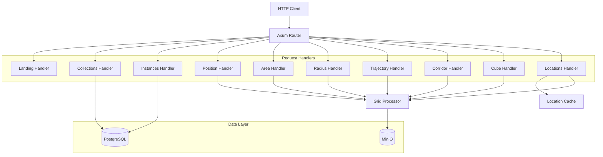

# EDR API Service

The EDR API service implements the OGC API - Environmental Data Retrieval specification, providing point-based, area-based, and volumetric data queries for weather model data.

## Overview

**Location**: `services/edr-api/`  
**Language**: Rust  
**Framework**: Axum (async web framework)  
**Port**: 8083 (configurable)  
**Scaling**: Horizontal

## Responsibilities

1. **OGC Compliance**: Implements EDR v1.0 specification with comprehensive conformance testing
2. **Data Queries**: Supports 7 query types: Position, Area, Radius, Trajectory, Corridor, Cube, Locations
3. **Collection Management**: Exposes weather data collections grouped by level type
4. **Instance Support**: Provides access to specific model runs as instances
5. **Named Locations**: Pre-defined points of interest for human-readable queries
6. **Response Limits**: Enforces configurable limits to prevent resource exhaustion
7. **Metrics**: Exposes Prometheus metrics for monitoring

## Architecture



## Endpoints

### Discovery Endpoints

| Endpoint | Method | Description |
|----------|--------|-------------|
| `/edr` | GET | Landing page with API links |
| `/edr/conformance` | GET | Supported conformance classes |
| `/edr/api` | GET | OpenAPI specification (YAML) |
| `/edr/api.html` | GET | Interactive API documentation (ReDoc) |

### Collection Endpoints

| Endpoint | Method | Description |
|----------|--------|-------------|
| `/edr/collections` | GET | List all collections |
| `/edr/collections/{id}` | GET | Collection metadata |
| `/edr/collections/{id}/instances` | GET | List model run instances |
| `/edr/collections/{id}/instances/{instId}` | GET | Instance metadata |

### Query Endpoints

| Endpoint | Method | Description |
|----------|--------|-------------|
| `/edr/collections/{id}/position` | GET | Position query (point data) |
| `/edr/collections/{id}/area` | GET | Area query (polygon data) |
| `/edr/collections/{id}/radius` | GET | Radius query (circular area) |
| `/edr/collections/{id}/trajectory` | GET | Trajectory query (path data) |
| `/edr/collections/{id}/corridor` | GET | Corridor query (buffered path) |
| `/edr/collections/{id}/cube` | GET | Cube query (3D volume) |
| `/edr/collections/{id}/locations` | GET | List named locations |
| `/edr/collections/{id}/locations/{locId}` | GET | Query at named location |

All query endpoints also support instance-specific versions:
- `/edr/collections/{id}/instances/{instId}/position`
- `/edr/collections/{id}/instances/{instId}/area`
- `/edr/collections/{id}/instances/{instId}/radius`
- `/edr/collections/{id}/instances/{instId}/trajectory`
- `/edr/collections/{id}/instances/{instId}/corridor`
- `/edr/collections/{id}/instances/{instId}/cube`
- `/edr/collections/{id}/instances/{instId}/locations`
- `/edr/collections/{id}/instances/{instId}/locations/{locId}`

### Diagnostic Endpoints

| Endpoint | Method | Description |
|----------|--------|-------------|
| `/edr/catalog-check` | GET | Returns actual database contents for validation |

### Operations Endpoints

| Endpoint | Method | Description |
|----------|--------|-------------|
| `/health` | GET | Basic health check |
| `/ready` | GET | Readiness check (DB connectivity) |
| `/metrics` | GET | Prometheus metrics |

## Configuration

### Environment Variables

```bash
# Server
EDR_LISTEN_ADDR=0.0.0.0:8083     # Listen address
EDR_BASE_URL=http://localhost:8083/edr  # Base URL for links

# Database
DATABASE_URL=postgresql://...     # PostgreSQL connection

# Object Storage
S3_ENDPOINT=http://minio:9000    # MinIO/S3 endpoint
S3_BUCKET=weather-data           # Bucket name
S3_ACCESS_KEY=minioadmin         # Access key
S3_SECRET_KEY=minioadmin         # Secret key

# Performance
EDR_CHUNK_CACHE_MB=256           # Grid processor chunk cache

# Logging
RUST_LOG=info                    # Log level
```

### Collection Configuration

Collections are defined in YAML files under `config/edr/`:

```yaml
# config/edr/hrrr.yaml
model: hrrr

collections:
  - id: hrrr-isobaric
    title: "HRRR - Isobaric Levels"
    description: "Upper-air parameters on pressure levels"
    level_filter:
      level_type: isobaric
      level_code: 100
    parameters:
      - name: TMP
        levels: [850, 700, 500, 300, 250]
      - name: UGRD
        levels: [850, 700, 500]
    run_mode: instances

settings:
  output_formats:
    - application/vnd.cov+json
    - application/geo+json
  default_crs: "CRS:84"
  supported_crs:
    - "CRS:84"
    - "EPSG:4326"

limits:
  max_parameters_per_request: 10
  max_time_steps: 48
  max_vertical_levels: 20
  max_response_size_mb: 50
  max_area_sq_degrees: 100
```

### Locations Configuration

Named locations are defined in `config/edr/locations.yaml`:

```yaml
locations:
  - id: KJFK
    name: "John F. Kennedy International Airport"
    description: "New York, NY"
    coords: [-73.7781, 40.6413]
    properties:
      type: airport
      country: US

  - id: NYC
    name: "New York City"
    description: "Manhattan, New York"
    coords: [-74.0060, 40.7128]
    properties:
      type: city
      country: US
```

See [EDR Configuration](../configuration/edr.md) for full details.

### Configuration Hot-Reload

The EDR configuration can be reloaded without restarting the service by calling:

```bash
curl -X POST http://localhost:8083/api/config/reload
```

## Code Structure

```
services/edr-api/src/
├── main.rs                 # Entry point, server setup
├── lib.rs                  # Module exports
├── state.rs                # Application state (catalog, grid-processor)
├── config.rs               # EDR config loading
├── limits.rs               # Response size estimation
├── content_negotiation.rs  # Accept header and f parameter handling
├── location_cache.rs       # In-memory cache for location queries
├── handlers/
│   ├── mod.rs              # Handler module exports
│   ├── landing.rs          # Landing page handler
│   ├── conformance.rs      # Conformance handler
│   ├── api.rs              # OpenAPI spec handler
│   ├── collections.rs      # Collections handlers
│   ├── instances.rs        # Instances handlers
│   ├── position.rs         # Position query handler
│   ├── area.rs             # Area query handler
│   ├── radius.rs           # Radius query handler
│   ├── trajectory.rs       # Trajectory query handler
│   ├── corridor.rs         # Corridor query handler
│   ├── cube.rs             # Cube query handler
│   ├── locations.rs        # Locations query handler
│   ├── catalog_check.rs    # Database contents diagnostic endpoint
│   └── health.rs           # Health/metrics handlers
└── Dockerfile
```

## Dependencies

Key crates used:

- **edr-protocol** - EDR types, CoverageJSON, GeoJSON, query parsing
- **grid-processor** - Weather data access and interpolation
- **storage** - Catalog and metadata queries
- **axum** - HTTP framework
- **tokio** - Async runtime

## Response Formats

### CoverageJSON

The primary response format for data queries:

```json
{
  "type": "Coverage",
  "domain": {
    "type": "Domain",
    "domainType": "Point",
    "axes": {
      "x": {"values": [-97.5]},
      "y": {"values": [35.2]},
      "t": {"values": ["2024-12-29T12:00:00Z"]}
    }
  },
  "parameters": {
    "TMP": {
      "type": "Parameter",
      "observedProperty": {"label": {"en": "Temperature"}},
      "unit": {"symbol": "K"}
    }
  },
  "ranges": {
    "TMP": {
      "type": "NdArray",
      "dataType": "float",
      "values": [288.5]
    }
  }
}
```

### GeoJSON

Alternative format for GIS integration:

```json
{
  "type": "FeatureCollection",
  "features": [
    {
      "type": "Feature",
      "geometry": {"type": "Point", "coordinates": [-97.5, 35.2]},
      "properties": {
        "datetime": "2024-12-29T12:00:00Z",
        "TMP": {"value": 288.5, "unit": "K"}
      }
    }
  ]
}
```

### Domain Types by Query

| Query Type | Domain Type | Description |
|------------|-------------|-------------|
| Position | Point | Single point |
| Position (multi-time) | PointSeries | Time series at point |
| Position (multi-z) | VerticalProfile | Vertical profile at point |
| Area | Grid | 2D grid within polygon |
| Radius | Grid | 2D grid within circle |
| Trajectory | Trajectory | Path with composite axis |
| Corridor | CoverageCollection | Multiple cross-sections |
| Cube | CoverageCollection | Grid per z-level |
| Locations | Point/PointSeries/VerticalProfile | Depends on query params |

## Performance

### Caching Strategy

- **Chunk Cache**: Grid processor maintains a shared chunk cache for Zarr data
- **Location Cache**: In-memory cache for location queries with `X-Cache` header
- **HTTP Cache Headers**: All responses include appropriate `Cache-Control` headers

### Cache Headers

| Response Type | Cache-Control |
|---------------|---------------|
| Data queries | `max-age=300` (5 minutes) |
| Collections/instances | `max-age=60` (1 minute) |
| Locations list | `max-age=3600` (1 hour) |
| Location data | `max-age=300` (5 minutes) |
| Catalog check | `no-cache, no-store, must-revalidate` |

### Throughput

| Scenario | Requests/sec | Latency (p99) |
|----------|--------------|---------------|
| Position (1 param) | 500+ | <50ms |
| Position (10 params) | 200 | <100ms |
| Area (small polygon) | 100 | <200ms |
| Trajectory | 150 | <150ms |
| Location (cached) | 1000+ | <10ms |

### Scaling

The service can be horizontally scaled. Each instance maintains its own chunk cache but shares the same database and storage.

## Monitoring

### Key Metrics

```
# Request counts
edr_requests_total{endpoint="position"}
edr_requests_total{endpoint="area"}
edr_requests_total{endpoint="trajectory"}
edr_requests_total{endpoint="locations"}

# Latency
edr_request_duration_seconds_bucket{endpoint="position",le="0.1"}

# Cache performance
grid_processor_chunk_cache_hits_total
grid_processor_chunk_cache_misses_total
location_cache_hits_total
location_cache_misses_total
```

## Troubleshooting

### High Latency

**Symptoms**: Queries taking >100ms

**Causes**:
1. Cold chunk cache
2. Large number of parameters requested
3. Large area/trajectory
4. Database slow

**Solutions**:
- Increase chunk cache size
- Limit parameters per request
- Reduce query area
- Check database connectivity

### Memory Usage

**Symptoms**: High memory consumption

**Causes**:
1. Chunk cache too large
2. Many concurrent large queries
3. Location cache accumulation

**Solutions**:
- Reduce `EDR_CHUNK_CACHE_MB`
- Lower response size limits in config

### 413 Errors

**Symptoms**: Clients getting "Payload Too Large"

**Causes**:
1. Requesting too many parameters
2. Area/bbox too large
3. Too many time steps

**Solutions**:
- Break large requests into smaller ones
- Check limits in collection config

### Location Not Found

**Symptoms**: 404 error for location query

**Causes**:
1. Location ID not in config
2. Case sensitivity issue (should be case-insensitive)

**Solutions**:
- Check `config/edr/locations.yaml` for available locations
- Use `GET /collections/{id}/locations` to list available locations

## See Also

- [EDR Endpoints](../api-reference/edr.md) - API documentation
- [EDR Configuration](../configuration/edr.md) - Configuration reference
- [edr-protocol Crate](../crates/edr-protocol.md) - Protocol types
- [grid-processor](../crates/grid-processor.md) - Data access layer
