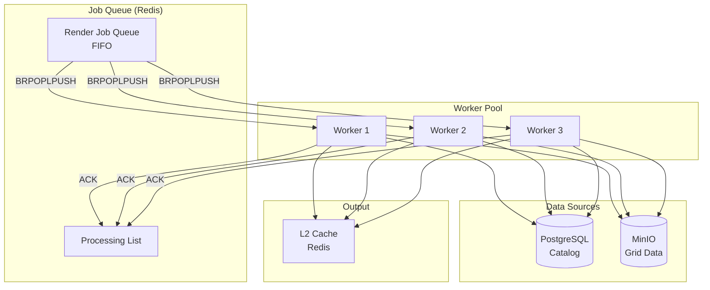

# Renderer Worker

The Renderer Worker is a background service that consumes render jobs from a Redis queue and generates PNG tiles for caching. It enables cache warming, prefetching, and scheduled tile rendering without blocking client requests.

## Overview

**Location**: `services/renderer-worker/`  
**Language**: Rust  
**Port**: None (background worker)  
**Scaling**: Horizontal

## Responsibilities

1. **Job Processing**: Consumes render jobs from Redis queue
2. **Tile Rendering**: Generates PNG tiles from grid data
3. **Cache Population**: Stores rendered tiles in L2 (Redis) cache
4. **Parallel Processing**: Multiple workers for throughput
5. **Fault Tolerance**: Job acknowledgment and retry

## Architecture



## Job Queue

### Job Structure

```rust
struct RenderJob {
    id: Uuid,
    layer: String,           // e.g., "gfs_TMP_2m"
    style: String,           // e.g., "temperature"
    crs: String,             // e.g., "EPSG:3857"
    bbox: BoundingBox,       // Geographic bounds
    width: u32,              // Tile width (usually 256)
    height: u32,             // Tile height (usually 256)
    time: Option<DateTime<Utc>>,  // Forecast time or None for latest
    format: String,          // e.g., "png"
    priority: u8,            // 0-255 (higher = more urgent)
    enqueued_at: DateTime<Utc>,
}
```

### Queue Operations

**Enqueue Job (WMS API)**:
```rust
async fn enqueue_render_job(
    redis: &Redis,
    job: &RenderJob,
) -> Result<()> {
    let job_json = serde_json::to_string(job)?;
    
    // Push to queue based on priority
    let queue_name = if job.priority > 128 {
        "render_queue:high"
    } else {
        "render_queue:normal"
    };
    
    redis.lpush(queue_name, job_json).await?;
    
    Ok(())
}
```

**Claim Job (Worker)**:
```rust
async fn claim_next_job(
    redis: &Redis,
    worker_name: &str,
) -> Result<Option<RenderJob>> {
    // Try high priority queue first
    if let Some(job_json) = redis
        .brpoplpush("render_queue:high", "render_queue:processing", 1.0)
        .await?
    {
        return Ok(Some(serde_json::from_str(&job_json)?));
    }
    
    // Fall back to normal priority
    if let Some(job_json) = redis
        .brpoplpush("render_queue:normal", "render_queue:processing", 5.0)
        .await?
    {
        return Ok(Some(serde_json::from_str(&job_json)?));
    }
    
    Ok(None)
}
```

**Acknowledge Job**:
```rust
async fn acknowledge_job(
    redis: &Redis,
    job: &RenderJob,
) -> Result<()> {
    let job_json = serde_json::to_string(job)?;
    redis.lrem("render_queue:processing", 1, &job_json).await?;
    Ok(())
}
```

## Rendering Process

### 1. Claim Job

```rust
loop {
    match queue.claim_next(&worker_name).await {
        Ok(Some(job)) => {
            info!(
                job_id = %job.id,
                layer = %job.layer,
                "Processing render job"
            );
            
            if let Err(e) = process_job(&job).await {
                error!(error = %e, "Job failed");
            }
        }
        Ok(None) => {
            // No jobs available, wait
            tokio::time::sleep(Duration::from_secs(1)).await;
        }
        Err(e) => {
            error!(error = %e, "Failed to claim job");
            tokio::time::sleep(Duration::from_secs(5)).await;
        }
    }
}
```

### 2. Query Catalog

Find grid metadata:

```rust
async fn find_grid_for_job(
    catalog: &Catalog,
    job: &RenderJob,
) -> Result<GridMetadata> {
    // Parse layer name: "gfs_TMP_2m" -> model="gfs", parameter="TMP_2m"
    let (model, parameter) = parse_layer_name(&job.layer)?;
    
    // Query catalog
    let time = job.time.unwrap_or_else(|| Utc::now());
    
    catalog.find_grid(model, parameter, time).await
}
```

### 3. Fetch Grid Data

```rust
async fn fetch_grid_data(
    storage: &ObjectStorage,
    metadata: &GridMetadata,
    bbox: &BoundingBox,
) -> Result<GridData> {
    // Determine intersecting shards
    let shard_indices = calculate_intersecting_shards(metadata, bbox);
    
    // Fetch shards in parallel
    let shard_futures: Vec<_> = shard_indices
        .iter()
        .map(|&i| {
            let path = format!("{}_shard_{:04}.bin", metadata.storage_path, i);
            storage.get_object(&path)
        })
        .collect();
    
    let shards = futures::future::try_join_all(shard_futures).await?;
    
    // Deserialize and merge shards
    merge_shards(shards)
}
```

### 4. Render Tile

```rust
async fn render_tile(
    grid_data: GridData,
    job: &RenderJob,
    style: &Style,
) -> Result<Vec<u8>> {
    // CPU-intensive work in blocking thread pool
    tokio::task::spawn_blocking(move || {
        // 1. Reproject to target CRS
        let reprojected = reproject_grid(
            &grid_data,
            &grid_data.projection,
            &job.crs,
        )?;
        
        // 2. Interpolate to tile dimensions
        let interpolated = interpolate_to_grid(
            &reprojected,
            job.width,
            job.height,
            &job.bbox,
        )?;
        
        // 3. Apply style (colormap, contours, etc.)
        let styled = apply_style(&interpolated, style)?;
        
        // 4. Encode as PNG
        let png_bytes = encode_png(&styled)?;
        
        Ok(png_bytes)
    })
    .await?
}
```

### 5. Store in Cache

```rust
async fn cache_tile(
    cache: &TileCache,
    job: &RenderJob,
    tile_data: Vec<u8>,
) -> Result<()> {
    let cache_key = CacheKey::new(
        &job.layer,
        &job.style,
        &job.crs,
        &job.bbox,
        job.width,
        job.height,
        job.time.clone(),
        &job.format,
    );
    
    // Determine TTL based on data age
    let ttl = calculate_ttl(&job.time);
    
    cache.set(&cache_key, &tile_data, Some(ttl)).await?;
    
    Ok(())
}
```

### 6. Acknowledge Job

```rust
queue.acknowledge(&job).await?;

info!(
    job_id = %job.id,
    duration_ms = start.elapsed().as_millis(),
    "Job completed successfully"
);
```

## Use Cases

### 1. Cache Warming

Pre-render tiles at startup or when new data arrives:

```rust
async fn warm_cache_for_layer(
    queue: &JobQueue,
    layer: &str,
    style: &str,
    max_zoom: u32,
) -> Result<()> {
    let mut jobs = Vec::new();
    
    for z in 0..=max_zoom {
        for x in 0..2u32.pow(z) {
            for y in 0..2u32.pow(z) {
                let bbox = tile_to_bbox(z, x, y);
                
                jobs.push(RenderJob {
                    id: Uuid::new_v4(),
                    layer: layer.to_string(),
                    style: style.to_string(),
                    crs: "EPSG:3857".to_string(),
                    bbox,
                    width: 256,
                    height: 256,
                    time: None,
                    format: "png".to_string(),
                    priority: 50,  // Low priority
                    enqueued_at: Utc::now(),
                });
            }
        }
    }
    
    // Enqueue all jobs
    for job in jobs {
        queue.enqueue(job).await?;
    }
    
    Ok(())
}
```

**Tile counts by zoom**:
- Zoom 0: 1 tile
- Zoom 1: 4 tiles
- Zoom 2: 16 tiles
- Zoom 3: 64 tiles
- Zoom 4: 256 tiles
- Zoom 5: 1,024 tiles

Warming zooms 0-4 = 341 tiles per layer/style/time combination.

---

### 2. Predictive Prefetching

When a tile is requested, enqueue surrounding tiles:

```rust
async fn prefetch_neighbors(
    queue: &JobQueue,
    center_job: &RenderJob,
    rings: u32,
) -> Result<()> {
    let (z, x, y) = bbox_to_tile(&center_job.bbox, &center_job.crs)?;
    
    for dy in -(rings as i32)..=(rings as i32) {
        for dx in -(rings as i32)..=(rings as i32) {
            if dx == 0 && dy == 0 {
                continue;  // Skip center
            }
            
            let neighbor_x = (x as i32 + dx) as u32;
            let neighbor_y = (y as i32 + dy) as u32;
            
            if !is_valid_tile(z, neighbor_x, neighbor_y) {
                continue;
            }
            
            let neighbor_bbox = tile_to_bbox(z, neighbor_x, neighbor_y);
            
            let neighbor_job = RenderJob {
                id: Uuid::new_v4(),
                layer: center_job.layer.clone(),
                style: center_job.style.clone(),
                crs: center_job.crs.clone(),
                bbox: neighbor_bbox,
                width: center_job.width,
                height: center_job.height,
                time: center_job.time,
                format: center_job.format.clone(),
                priority: 30,  // Lower priority than user requests
                enqueued_at: Utc::now(),
            };
            
            queue.enqueue(neighbor_job).await?;
        }
    }
    
    Ok(())
}
```

---

### 3. Scheduled Rendering

Pre-render forecast hours before they become active:

```rust
// Schedule job for future execution
async fn schedule_future_render(
    queue: &JobQueue,
    layer: &str,
    forecast_time: DateTime<Utc>,
) -> Result<()> {
    // Calculate when to render (e.g., 5 minutes before valid time)
    let render_time = forecast_time - Duration::minutes(5);
    let delay = (render_time - Utc::now()).to_std()?;
    
    tokio::spawn(async move {
        tokio::time::sleep(delay).await;
        
        warm_cache_for_layer(queue, layer, "default", 4).await?;
        
        Ok::<_, Error>(())
    });
    
    Ok(())
}
```

## Configuration

### Environment Variables

```bash
# Worker identity
WORKER_NAME=worker-1              # Unique worker name

# Concurrency
CONCURRENCY=4                     # Parallel render tasks

# Connections
REDIS_URL=redis://redis:6379      # Redis (queue + cache)
DATABASE_URL=postgresql://...     # PostgreSQL (catalog)
S3_ENDPOINT=http://minio:9000     # MinIO (grid data)

# Logging
RUST_LOG=info
```

### Command-Line Arguments

```bash
renderer-worker --help

USAGE:
    renderer-worker [OPTIONS]

OPTIONS:
    -n, --name <NAME>           Worker name [env: WORKER_NAME]
    -c, --concurrency <NUM>     Concurrent tasks [default: 4]
        --log-level <LEVEL>     Log level [default: info]
    -h, --help                  Print help
```

## Scaling

### Horizontal Scaling

Add more worker instances:

```yaml
# docker-compose.yml
services:
  renderer-worker:
    image: weather-wms/renderer-worker
    deploy:
      replicas: 5  # 5 workers
    environment:
      CONCURRENCY: 4  # Each worker runs 4 tasks
      # Total capacity: 5 × 4 = 20 parallel renders
```

### Performance

| Workers | Concurrency | Total Capacity | Tiles/Minute |
|---------|-------------|----------------|--------------|
| 1 | 4 | 4 | ~24 |
| 3 | 4 | 12 | ~72 |
| 5 | 4 | 20 | ~120 |
| 10 | 4 | 40 | ~240 |

(Assumes ~10s average render time per tile)

## Monitoring

### Logs

```json
{
  "timestamp": "2024-12-03T18:30:00Z",
  "level": "INFO",
  "target": "renderer_worker",
  "message": "Processing render job",
  "job_id": "550e8400-e29b-41d4-a716-446655440000",
  "layer": "gfs_TMP_2m",
  "worker": "worker-1"
}
```

```json
{
  "timestamp": "2024-12-03T18:30:08Z",
  "level": "INFO",
  "target": "renderer_worker",
  "message": "Job completed successfully",
  "job_id": "550e8400-e29b-41d4-a716-446655440000",
  "duration_ms": 8234
}
```

### Queue Statistics

Monitor queue depth:

```bash
# Queue length
redis-cli LLEN render_queue:normal
redis-cli LLEN render_queue:high
redis-cli LLEN render_queue:processing

# Items in processing (should be ~= worker count)
redis-cli LLEN render_queue:processing
```

### Worker Health

```bash
# Check active workers
docker-compose ps renderer-worker

# View worker logs
docker-compose logs -f renderer-worker

# Count recent completions
docker-compose logs renderer-worker | grep "Job completed" | tail -n 100
```

## Troubleshooting

### Jobs Stuck in Processing

**Symptom**: `render_queue:processing` grows without clearing

**Causes**:
- Worker crashed without acknowledging
- Job taking too long

**Solution**:
```bash
# Requeue stuck jobs (manual intervention)
redis-cli RPOPLPUSH render_queue:processing render_queue:normal

# Or flush processing queue (jobs will be re-enqueued by clients)
redis-cli DEL render_queue:processing
```

---

### Slow Rendering

**Symptom**: Jobs taking >30s each

**Causes**:
- Large grid files
- Complex styles (contours)
- Slow MinIO

**Solution**:
```bash
# Increase concurrency
CONCURRENCY=8

# Scale workers
docker-compose up -d --scale renderer-worker=5

# Check MinIO performance
curl http://localhost:9000/minio/health/live
```

---

### High Memory Usage

**Symptom**: Workers OOM killed

**Causes**:
- Too many concurrent tasks
- Large grids held in memory

**Solution**:
```yaml
# docker-compose.yml
services:
  renderer-worker:
    mem_limit: 4g
    environment:
      CONCURRENCY: 2  # Reduce concurrency
```

## Job Priority

Jobs can have priority 0-255:

| Priority | Use Case | Queue |
|----------|----------|-------|
| 200-255 | User-requested tiles (cache miss) | High |
| 100-199 | Prefetching | Normal |
| 50-99 | Cache warming (new data) | Normal |
| 0-49 | Scheduled future renders | Normal |

High-priority jobs are processed first.

## Next Steps

- [WMS API Service](./wms-api.md) - Job enqueuing
- [Renderer Crate](../crates/renderer.md) - Rendering implementation
- [Caching Strategy](../architecture/caching.md) - Cache warming strategies
