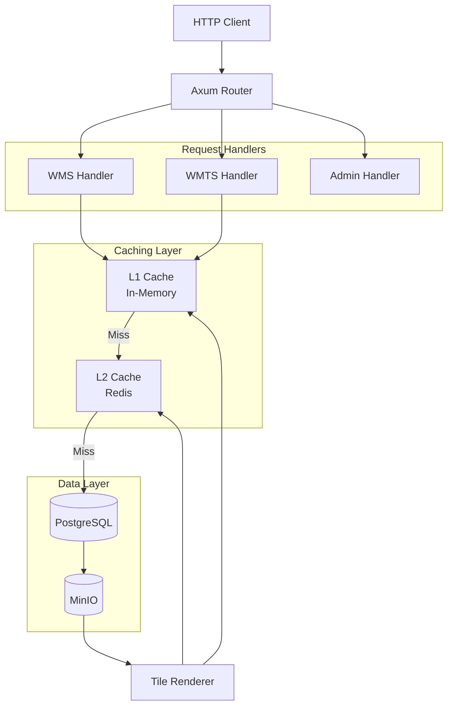

# WMS API Service

The WMS API service is the primary HTTP server that implements OGC Web Map Service (WMS) and Web Map Tile Service (WMTS) specifications. It serves map tiles and metadata to clients while managing a sophisticated two-tier caching system.

## Overview

**Location**: `services/wms-api/`  
**Language**: Rust  
**Framework**: Axum (async web framework)  
**Port**: 8080 (configurable)  
**Scaling**: Horizontal

## Responsibilities

1. **OGC Compliance**: Implements WMS 1.1.1/1.3.0 and WMTS 1.0.0 specifications
2. **Tile Serving**: Renders and caches weather map tiles
3. **Cache Management**: Maintains L1 (in-memory) cache
4. **Metadata**: Provides GetCapabilities and layer information
5. **Admin API**: Dashboard endpoints, cache management, proxies to ingester service
6. **Metrics**: Exposes Prometheus metrics for monitoring

> **Note**: Ingestion is handled by the dedicated [Ingester Service](./ingester.md). The wms-api proxies ingestion requests and status queries to the ingester.

## Architecture



## Endpoints

### OGC WMS Endpoints

#### GetCapabilities
```http
GET /wms?SERVICE=WMS&REQUEST=GetCapabilities&VERSION=1.3.0
```

Returns XML document describing available layers, styles, and coordinate systems.

**Response**: XML (WMS_Capabilities)

---

#### GetMap
```http
GET /wms?SERVICE=WMS&VERSION=1.3.0&REQUEST=GetMap
    &LAYERS=gfs_TMP_2m
    &STYLES=temperature
    &CRS=EPSG:3857
    &BBOX=-20037508,-20037508,20037508,20037508
    &WIDTH=256
    &HEIGHT=256
    &FORMAT=image/png
    &TIME=2024-12-03T00:00:00Z
```

Renders a map tile for the specified parameters.

**Response**: PNG image

---

#### GetFeatureInfo
```http
GET /wms?SERVICE=WMS&VERSION=1.3.0&REQUEST=GetFeatureInfo
    &QUERY_LAYERS=gfs_TMP_2m
    &LAYERS=gfs_TMP_2m
    &CRS=EPSG:4326
    &BBOX=-180,-90,180,90
    &WIDTH=256
    &HEIGHT=256
    &I=128
    &J=128
    &INFO_FORMAT=application/json
```

Returns data value at a specific pixel location.

**Response**: JSON with weather data value

---

### OGC WMTS Endpoints

#### GetCapabilities
```http
GET /wmts?SERVICE=WMTS&REQUEST=GetCapabilities
```

Returns XML document describing tile matrix sets and layers.

---

#### GetTile (KVP)
```http
GET /wmts?SERVICE=WMTS&REQUEST=GetTile
    &LAYER=gfs_TMP_2m
    &STYLE=temperature
    &TILEMATRIXSET=WebMercatorQuad
    &TILEMATRIX=4
    &TILEROW=5
    &TILECOL=3
    &FORMAT=image/png
```

---

#### GetTile (RESTful)
```http
GET /wmts/rest/{layer}/{style}/{TileMatrixSet}/{TileMatrix}/{TileRow}/{TileCol}.png
```

Example:
```http
GET /wmts/rest/gfs_TMP_2m/temperature/WebMercatorQuad/4/5/3.png
```

---

#### GetTile (XYZ)
```http
GET /tiles/{layer}/{style}/{z}/{x}/{y}.png
```

Non-standard but convenient endpoint compatible with Leaflet/OpenLayers XYZ layers.

Example:
```http
GET /tiles/gfs_TMP_2m/temperature/4/3/5.png
```

---

### Admin API Endpoints

#### Health Check
```http
GET /health
```

Returns service health status.

**Response**:
```json
{"status": "ok"}
```

---

#### Readiness Check
```http
GET /ready
```

Returns readiness status (checks database/cache connectivity).

**Response**:
```json
{"ready": true}
```

---

#### Prometheus Metrics
```http
GET /metrics
```

Exposes Prometheus-format metrics.

---

#### Trigger Ingestion (Proxy)
```http
POST /admin/ingest
Content-Type: application/json

{
  "file_path": "/data/downloads/gfs.t00z.pgrb2.0p25.f000",
  "model": "gfs"
}
```

Proxies ingestion request to the [Ingester Service](./ingester.md) at `http://ingester:8082/ingest`.

> **Note**: This endpoint forwards requests to the dedicated ingester service. Direct calls to the ingester are also supported.

---

#### Clear Caches
```http
POST /api/cache/clear
```

Clears L1 (in-memory) cache. L2 (Redis) cache remains.

**Response**:
```json
{"cleared": true, "entries_removed": 5234}
```

---

#### List Cached Tiles
```http
GET /api/cache/list?limit=100
```

Returns list of tiles in L1 cache.

---

#### Storage Statistics
```http
GET /api/storage/stats
```

Returns MinIO storage statistics.

**Response**:
```json
{
  "bucket": "weather-data",
  "total_objects": 15234,
  "total_size_bytes": 52428800000,
  "models": {
    "gfs": {"objects": 8000, "size_bytes": 30000000000},
    "hrrr": {"objects": 5000, "size_bytes": 18000000000}
  }
}
```

---

#### Get Available Forecast Times
```http
GET /api/forecast-times/:model/:parameter
```

Returns available forecast times for a model/parameter.

**Example**:
```http
GET /api/forecast-times/gfs/TMP_2m
```

**Response**:
```json
{
  "model": "gfs",
  "parameter": "TMP_2m",
  "times": [
    {"forecast_time": "2024-12-03T00:00:00Z", "forecast_hours": [0, 3, 6, ..., 384]},
    {"forecast_time": "2024-12-02T18:00:00Z", "forecast_hours": [0, 3, 6, ..., 240]}
  ]
}
```

---

#### Get Available Parameters
```http
GET /api/parameters/:model
```

Returns available parameters for a model.

**Example**:
```http
GET /api/parameters/gfs
```

**Response**:
```json
{
  "model": "gfs",
  "parameters": [
    {"name": "TMP_2m", "description": "Temperature at 2m", "units": "K"},
    {"name": "UGRD_10m", "description": "U-component wind at 10m", "units": "m/s"},
    {"name": "VGRD_10m", "description": "V-component wind at 10m", "units": "m/s"}
  ]
}
```

---

#### Get Configuration
```http
GET /api/config
```

Returns current service configuration.

**Response**:
```json
{
  "l1_cache_enabled": true,
  "l1_cache_size": 10000,
  "l2_cache_enabled": true,
  "prefetch_enabled": true,
  "cache_warming_enabled": true
}
```

---

#### Application Metrics (JSON)
```http
GET /api/metrics
```

Returns detailed metrics for the web dashboard including request rates, cache stats, and per-data-source parsing statistics.

---

#### Container Stats
```http
GET /api/container/stats
```

Returns CPU, memory, and load average statistics for the container/process.

---

#### Tile Request Heatmap
```http
GET /api/tile-heatmap
```

Returns geographic distribution of tile requests for visualization. Each WMS/WMTS tile request is recorded and aggregated by location (0.1° resolution).

**Response**:
```json
{
  "cells": [
    {"lat": 38.5, "lng": -95.5, "count": 42}
  ],
  "total_requests": 42
}
```

---

#### Clear Heatmap
```http
POST /api/tile-heatmap/clear
```

Clears tile request heatmap data.

---

## Configuration

### Environment Variables

```bash
# Server
LISTEN_ADDR=0.0.0.0:8080          # Listen address and port
TOKIO_WORKER_THREADS=8            # Async runtime threads

# Database
DATABASE_URL=postgresql://...     # PostgreSQL connection
DATABASE_POOL_SIZE=50             # Connection pool size

# Redis
REDIS_URL=redis://redis:6379      # Redis connection

# Object Storage
S3_ENDPOINT=http://minio:9000     # MinIO/S3 endpoint
S3_BUCKET=weather-data            # Bucket name
S3_ACCESS_KEY=minioadmin          # Access key
S3_SECRET_KEY=minioadmin          # Secret key

# L1 Cache (In-Memory)
ENABLE_L1_CACHE=true              # Enable L1 cache
TILE_CACHE_SIZE=10000             # Max entries (~300MB)
TILE_CACHE_TTL_SECS=300           # Entry TTL (5 minutes)

# L2 Cache (Redis)
REDIS_TILE_TTL_SECS=3600          # Entry TTL (1 hour)

# Prefetching
ENABLE_PREFETCH=true              # Enable tile prefetching
PREFETCH_RINGS=2                  # Rings to prefetch (1=8, 2=24)
PREFETCH_MIN_ZOOM=3               # Min zoom for prefetch
PREFETCH_MAX_ZOOM=12              # Max zoom for prefetch

# Cache Warming
ENABLE_CACHE_WARMING=true         # Warm cache at startup
CACHE_WARMING_MAX_ZOOM=4          # Max zoom to warm
CACHE_WARMING_LAYERS=gfs_TMP_2m:temperature  # Layers to warm

# Logging
RUST_LOG=info                     # Log level
```

### Command-Line Arguments

```bash
wms-api --help

USAGE:
    wms-api [OPTIONS]

OPTIONS:
    -l, --listen <ADDR>           Listen address [default: 0.0.0.0:8080]
        --log-level <LEVEL>       Log level [default: info]
        --worker-threads <NUM>    Tokio worker threads [default: CPU cores]
    -h, --help                    Print help information
```

## Request Processing Flow

### Cache Hit (L1)
```
Client Request → Router → Handler → L1 Cache → Response
Latency: <1ms
```

### Cache Hit (L2)
```
Client Request → Router → Handler → L1 Miss → L2 Cache → Response
Latency: 2-5ms
```

### Cache Miss (Full Render)
```
Client Request → Router → Handler → L1 Miss → L2 Miss → Query Catalog
→ Fetch Shards from MinIO → Render Tile → Store L2 → Store L1 → Response
Latency: 20-100ms
```

## Performance Characteristics

### Throughput

| Scenario | Requests/sec | Latency (p99) |
|----------|--------------|---------------|
| L1 Cache Hit | 10,000+ | <1ms |
| L2 Cache Hit | 2,000 | <10ms |
| Cache Miss | 200 | <100ms |

### Scaling

- **1 instance**: ~500 req/s sustained
- **3 instances**: ~1,500 req/s sustained
- **10 instances**: ~5,000 req/s sustained

(Assumes 85% cache hit rate)

## Monitoring

### Key Metrics

Exposed at `/metrics` in Prometheus format:

```
# Request counts
wms_requests_total{endpoint="GetMap",status="200"} 150234
wms_requests_total{endpoint="GetTile",status="200"} 89234

# Latency
wms_request_duration_seconds_bucket{endpoint="GetMap",le="0.001"} 120000
wms_request_duration_seconds_bucket{endpoint="GetMap",le="0.01"} 145000

# Cache performance
wms_cache_hits_total{tier="l1"} 125000
wms_cache_hits_total{tier="l2"} 20000
wms_cache_misses_total 5000

# Active connections
wms_active_connections 42
```

### Request Rate Tracking

The API tracks request rates over 1-minute and 5-minute windows for:
- WMS requests
- WMTS requests  
- Tile renders

Available via `/api/metrics` as `wms_rate_1m`, `wmts_rate_1m`, etc.

### Per-Data-Source Metrics

Parsing statistics are tracked per data source type:
- **GFS** (GRIB2): Global forecast model
- **HRRR** (GRIB2): High-resolution regional model
- **MRMS** (GRIB2): Radar composite
- **GOES** (NetCDF): Satellite imagery

Each source tracks:
- Parse count and cache hit rate
- Average, min, max parse times
- Last parse time

### Tile Request Heatmap

Geographic distribution of tile requests is tracked in real-time for visualization in the web dashboard minimap. Useful for:
- Monitoring load test geographic patterns
- Identifying request hot spots
- Debugging tile distribution issues

### Grafana Dashboards

Pre-configured dashboards available at: http://localhost:3000

**Main Dashboard (wms-performance)**:
- Request rate by endpoint
- Latency percentiles (p50, p95, p99)
- Cache hit rates (L1, L2, total)
- Error rates
- Memory usage

**Per-Model Dashboards**:
- GFS Pipeline (`gfs-pipeline`)
- HRRR Pipeline (`hrrr-pipeline`)
- GOES Pipeline (`goes-pipeline`)
- MRMS Pipeline (`mrms-pipeline`)

Each model dashboard shows:
- Parse times and cache efficiency
- Request distribution
- Render performance

## Troubleshooting

### High Latency

**Symptoms**: Requests taking >100ms consistently

**Causes**:
1. Low cache hit rate
2. MinIO storage slow
3. Database connection pool exhausted

**Solutions**:
```bash
# Check cache hit rate
curl http://localhost:8080/metrics | grep wms_cache

# Increase cache size
TILE_CACHE_SIZE=50000

# Increase DB pool
DATABASE_POOL_SIZE=100
```

---

### Memory Usage Growing

**Symptoms**: Container OOM or high memory usage

**Causes**:
1. L1 cache too large
2. Memory leak (unlikely in Rust)

**Solutions**:
```bash
# Reduce cache size
TILE_CACHE_SIZE=5000

# Monitor with metrics
curl http://localhost:8080/metrics | grep process_resident_memory_bytes
```

---

### Connection Timeouts

**Symptoms**: Clients receiving 504 Gateway Timeout

**Causes**:
1. Database slow queries
2. MinIO slow reads
3. Insufficient worker threads

**Solutions**:
```bash
# Increase worker threads
TOKIO_WORKER_THREADS=16

# Check database
docker-compose exec postgres psql -U weatherwms -c "SELECT * FROM pg_stat_activity;"

# Check MinIO
curl http://localhost:9000/minio/health/live
```

## Code Structure

```
services/wms-api/src/
├── main.rs               # Entry point, server setup
├── state.rs              # Application state (connections, config)
├── handlers.rs           # HTTP request handlers
├── admin.rs              # Admin API handlers (proxies to ingester for ingestion)
├── rendering/            # Tile rendering logic
│   ├── mod.rs            # Main rendering functions
│   ├── loaders.rs        # Zarr data loading
│   ├── resampling.rs     # Grid resampling for tiles
│   └── ...
├── validation.rs         # Request validation
├── warming.rs            # Tile cache warming at startup
├── cleanup.rs            # Background cleanup tasks
├── chunk_warming.rs      # Zarr chunk pre-caching for observation data
├── memory_pressure.rs    # Memory management and cache eviction
├── metrics.rs            # Prometheus metrics
├── layer_config.rs       # Layer configuration loading
└── startup_validation.rs # Startup health checks
```

> **Note**: Ingestion logic has been moved to the `crates/ingestion` library and `services/ingester` service. The `admin.rs` file now proxies ingestion requests to the ingester service.

## Dependencies

Key Rust crates used:

- **axum**: Web framework
- **tokio**: Async runtime
- **sqlx**: PostgreSQL client
- **redis**: Redis client
- **aws-sdk-s3**: MinIO/S3 client
- **prometheus**: Metrics
- **tower-http**: HTTP middleware (compression, tracing, CORS)

## Next Steps

- [API Reference](../api-reference/README.md) - Complete endpoint documentation
- [Caching Strategy](../architecture/caching.md) - Cache tuning guide
- [Deployment](../deployment/README.md) - Production deployment
